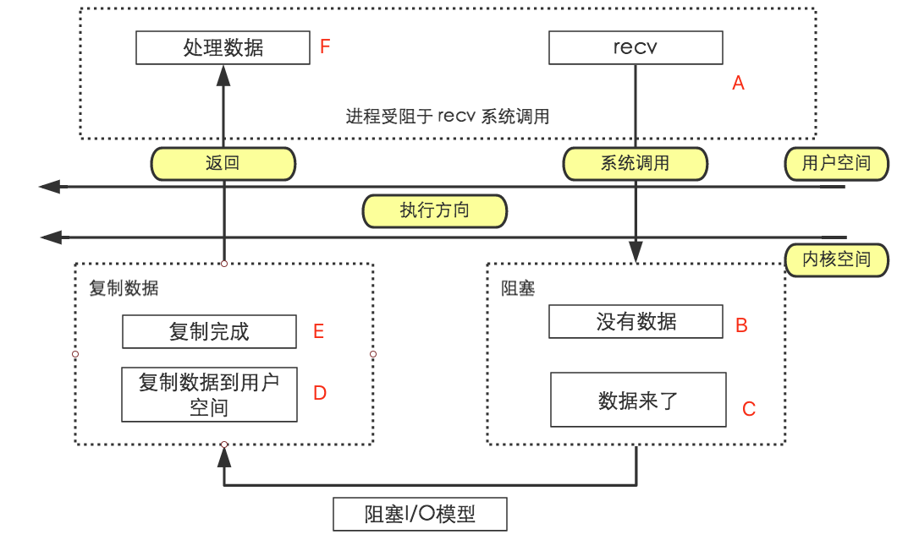
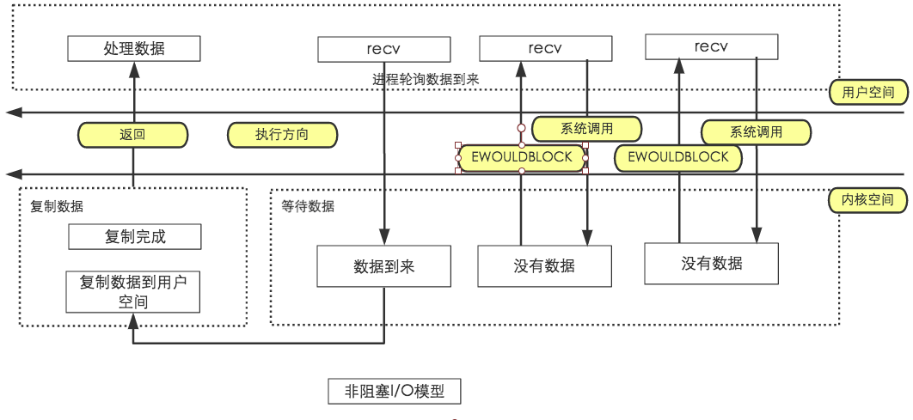

socket 函数 (TODO)
```
连接等:socket、bind、listen、accept、connect
确定字节数的读取(解决粘包问题1) readn、writen[先接收包体后接受包体]

read、write 与 recv、send
readline 实现
用 readline 实现回射客户/服务器
getsockname、getpeername
gethostname、gethostbyname、gethostbyaddr

管道

僵尸进程：signal
```

TCP回射客户/服务器
```
stdin -[fgets]-> {TCP客户端} -[writen]-[readline]-> {TCP服务器}
stdout<-[fputs]- {TCP客户端} -[readline]-[writen]-> {TCP服务器}
```


流协议与粘包
> 1、TCP是基于字节流的传输服务，无边界(流协议)，不能保证接收方一次读操作能返回多少个字节，多少个消息[不维护消息与消息的边界]
> 2、UDP是基于消息的传输服务，传输报文，有边界，能够保证接收方一次读操作能返回多少个字节，多少个消息
> 3、所以字节流的TCP会产生粘包问题


### 粘包产生的原因

> 1、应用进程缓冲区大小套接口发送缓冲区(SO_SNDBUF)，就会发生粘包问题，因为消息被分割发送了；
> 2、TCP 传输的有最大段(MSS)限制，会对消息进行分割；
> 3、链路层所传输的数据有一个最大的传输单元(MTU)限制,所发送的数据大于MTU会在 IP 层进行分组(分片)，可能导致消息分割；
> 4、TCP的流量控制(窗口流量)、拥塞控制(?)、延时发送机制...

解决粘包问题
> 本质上是要在应用层维护消息与消息的边界
> 1、定长包 [导致流量的浪费]
> 2、包尾加 \r\n (ftp) [如果 \r\n 是有包数据，则有问题]
> 3、包头加上包体长度 [定长的头部+不定长的包体]
> 4、更复杂的应用层协议

僵进程与 SIGCHLD 信号

TCP状态

> 11 种状态
> listen:被动套接口
> connect:主动套接口
> 
> 1、LISTEN: 监听
> 2、SYN_SENT: 发起连接
> 3、SYN_RCVD: 
> 4、ESTABUSHED:连接
> 5、FIN_WAIT_1:
> 6、FIN_WAIT_2:
> 7、CLOSE_WAIT:
> 8、LAST_ACK:
> 9、CLOSING: 特殊的状态，产生的原因是双方同时关闭(双方都调用close,双方都处于FIN_WAIT_1，然后都接收到对方的关闭消息时，会处于CLOSING,然后在接收到ACK 后都处在 TIME_WAIT)
> 10、TIME_WAIT: 2*MSL(2倍生存时间，确保可以重传 ACK)，主动关闭方会产生的
> 11、CLOSED: 关闭

TIME_WAIT 与 SO_REUSEADDR
> 服务器处于 TIME_WAIT(2*MSL), 无法重新启动，所以服务器要设置 SO_REUSEADDR，然后可以重新启动

产生 SIGPIPE 的原因(管道)
> 1、往一个 已经接收 FIN 的套接字中写是允许的，接收到 FIN 仅仅代表对方不再发生数据。如果发生数据给对方，对方进程不存在时，会发生TCP 重置，对方的TCP协议栈会发送 RST TCP段。
> 2、在接收 RST 段之后，如果再调用 write 就会产生 SIGPIPE 信号，对于这个信号的处理我们通常忽略即可

### 五种 I/O 模型
阻塞I/O

> 1、完成连接后，接收数据，向系统提交 [A]recv 请求(阻塞的请求)，[B]等待接收数据；
> 2、[C]直到对方发送数据过来，填充recv这个套接口所对应的接收缓冲区，才解除阻塞。
> 3、[C]将这些数据从内核空间(套接口所对应的接收缓冲区)，拷贝到用户空间缓冲区(buf)[D]。
> 4、[F]recv 返回给用户空间，处理数据

非阻塞I/O

> 1、调用 recv,套接字将其设置为非阻塞模型[fcntl(fd, F_SEIFL, flag|O_NONBLOCK)]
> 2、
> 3、
> 4、

I/O复用(select 和 poll)
信号驱动I/O
异步I/O


