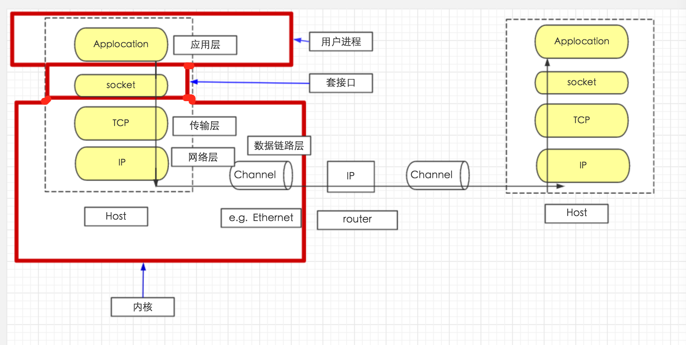
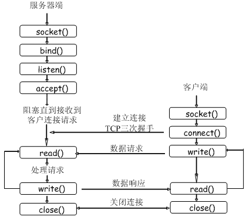
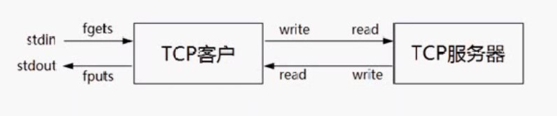
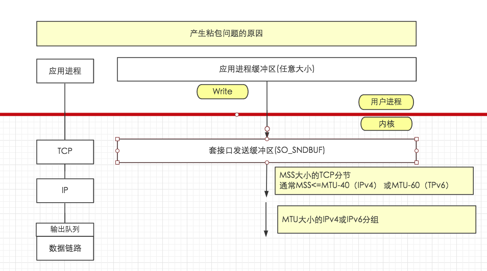

### socket 的概念

```
用户进程：应用层的操作，工作在用户空间
内核：TCP/IP 协议栈 除了应用层，都属于内核的一部分
socket(套接口)：用户进程与内核网络协议栈的编程接口。
用于进程间通信，(属于全双工通信)，可以用于网络上不同的主机进程间通信。[不去关心底层传输的细节]
异构系统通信：软件平台不一样，硬件也不一样。
```

网络字节序
```
大端字节序：最高有效位存储于最低内存地址，最低有效位存储于最高内存地址
小端字节序：最高有效位存储于最高内存地址，最低有效位存储于最低内存地址
主机字节序：不同的主机有不同的字节序。可能为 大端字节序 也可能为 大端字节序
网络字节序：规定为 大端字节序
HostA->[主机字节序转换为网络字节序]->[网络传输]->[网络字节序转换为主机字节序]->HostB
```

字节序转换函数
```
uint32_t htonl(uint32_t hostlong); // htonl h(主机字节序) to(转换为) n(网络字节序) l(long)
uint16_t htons(uint16_t hostshort);
uint32_t ntohl(uint32_t netlong); // ntohl n(网络字节序) to(转换为) h(主机字节序) l(long)
uint16_t ntohs(uint16_t netshort);

说明：
    h 代表 host
    n 代表 network
    s 代表 short
    l 代表 long   
```

地址转换函数
```
#include <netinet/in.h>
#include <arpa/inet.h>

int inet_aton(const char *cp, struct in_add *inp); // 将点分十进制IP转换成网络字节序地址，和 inet_addr 一样，参数不同
in_addr_t inet_addr(const char *cp); // 将点分十进制IP转换为32位整数
char *inet_ntoa(struct in_addr in); // 将地址结构转换为点分十进制的IP地址
```

套接字类型
```
流式套接字(SOCK_STREAM): // TCP
    面向连接、可靠数据传输、数据无差错、无重复发送、按发送顺序接收
数据报式套接字(SOCK_DGRAM):
    无连接服务、不提供无错保证、数据可能丢失或重复、接收顺序混乱
原始套接字(SOCK_RAW):
    跨越传输层，直接对IP层进行封装的套接字
    通过 原始套接字 可以将应用层数据直接封装成 IP 层可认识的协议格式
```




socket函数
```
包含头文件 <sys/socket.h>
功能：创建一个套接字用于通信
原型：
    int socket(int domain, int type, int protocol);
参数：
    domain：指定通信协议族(protocol family)
    type:指定 socket 类型
    protocol:协议类型
返回值:非负整数，套接字，失败返回 -1
```

socket 函数 (TODO)
```
连接等:socket、bind、listen、accept、connect
确定字节数的读取(解决粘包问题1) readn、writen[先接收包体后接受包体]

read、write 与 recv、send
readline 实现
用 readline 实现回射客户/服务器
getsockname、getpeername
gethostname、gethostbyname、gethostbyaddr

管道

僵尸进程：signal
```

TCP回射客户/服务器
```
stdin -[fgets]-> {TCP客户端} -[writen]-[readline]-> {TCP服务器}
stdout<-[fputs]- {TCP客户端} -[readline]-[writen]-> {TCP服务器}
```

流协议与粘包
```
1、TCP是基于字节流的传输服务，无边界(流协议)   ，不能保证接收方一次读操作能返回多少个字节，多少个消息[不维护消息与消息的边界]   
2、UDP是基于消息的传输服务，传输报文，有边界，能够保证接收方一次读操作能返回多少个字节，多少个消息   
3、所以字节流的TCP会产生粘包问题   
```


### 粘包产生的原因

```
1、应用进程缓冲区大小套接口发送缓冲区(SO_SNDBUF)，就会发生粘包问题，因为消息被分割发送了；   
2、TCP 传输的有最大段(MSS)限制，会对消息进行分割；   
3、链路层所传输的数据有一个最大的传输单元(MTU)限制,所发送的数据大于MTU会在 IP 层进行分组(分片)，可能导致消息分割；   
4、TCP的流量控制(窗口流量)、拥塞控制(?)、延时发送机制...   
```

解决粘包问题
```
本质上是要在应用层维护消息与消息的边界
1、定长包 [导致流量的浪费]   
2、包尾加 \r\n (ftp) [如果 \r\n 是有包数据，则有问题]   
3、包头加上包体长度 [定长的头部+不定长的包体]   
4、更复杂的应用层协议   
```

僵进程与 SIGCHLD 信号

TCP状态

```
11 种状态   
listen:被动套接口   
connect:主动套接口   
 
1、LISTEN: 监听   
2、SYN_SENT: 发起连接   
3、SYN_RCVD:   
4、ESTABUSHED:连接  
5、FIN_WAIT_1:  
6、FIN_WAIT_2:  
7、CLOSE_WAIT:  
8、LAST_ACK:  
9、CLOSING: 特殊的状态，产生的原因是双方同时关闭(双方都调用close,双方都处于FIN_WAIT_1，然后都接收到对方的关闭消息时，会处于CLOSING,然后在接收到ACK 后都处在 TIME_WAIT)   
10、TIME_WAIT: 2*MSL(2倍生存时间，确保可以重传 ACK)，主动关闭方会产生的   
11、CLOSED: 关闭  

TIME_WAIT 与 SO_REUSEADDR
服务器处于 TIME_WAIT(2*MSL), 无法重新启动，所以服务器要设置SO_REUSEADDR，然后可以重新启动
```


产生 SIGPIPE 的原因(管道)
```
1、往一个 已经接收 FIN 的套接字中写是允许的，接收到 FIN 仅仅代表对方不再发生数据。如果发生数据给对方，对方进程不存在时，会发生TCP 重置，对方的TCP协议栈会发送 RST TCP段。   
2、在接收 RST 段之后，如果再调用 write 就会产生 SIGPIPE 信号，对于这个信号的处理我们通常忽略即可
```


### 五种 I/O 模型
阻塞I/O
   
```
1、完成连接后，接收数据，向系统提交 [A]recv 请求(阻塞的请求)，[B]等待接收数据；   
2、[C]直到对方发送数据过来，填充recv这个套接口所对应的接收缓冲区，才解除阻塞。   
3、[C]将这些数据从内核空间(套接口所对应的接收缓冲区)，拷贝到用户空间缓冲区(buf)[D];   
4、[F]recv 返回给用户空间，处理数据。   
```

非阻塞I/O
 
```
1、调用 recv,套接字将其设置为非阻塞模型[fcntl(fd, F_SEIFL, flag|O_NONBLOCK)]；
2、调用recv，即使没有数据到来也不会发生阻塞，会返回错误，返回值为-1，错误代码为EWOULDBLOCK；
3、再次 调用 recv，直到有数据到来；
4、将数据从内核空间拷贝到用户空间
5、拷贝完成返回。 

应用层面比较窄，在数据没有到来时，不断的循环接收数据，直到数据到来，对CPU 资源造成浪费，称 忙等待 (不推荐使用)
```

I/O复用(select 和 poll) 
```
```

信号驱动I/O   
```
```

异步I/O   
```
```



































































































































end