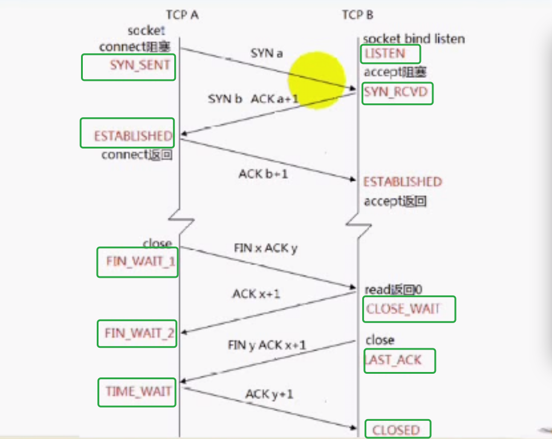
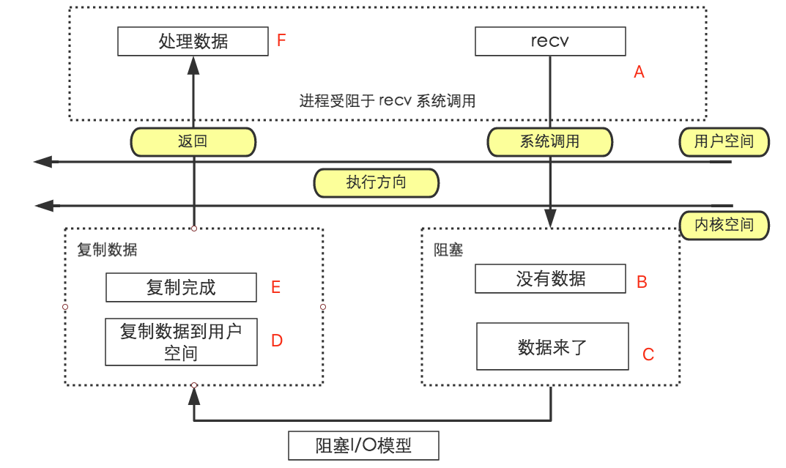
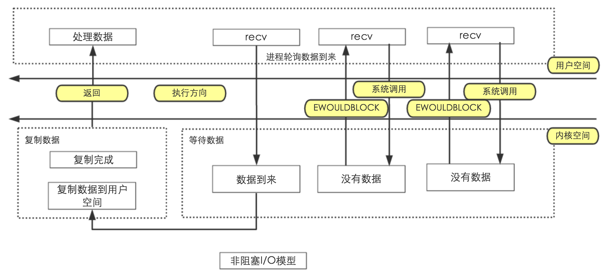
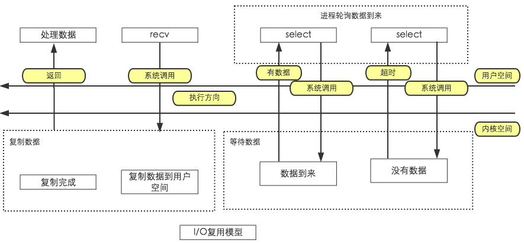
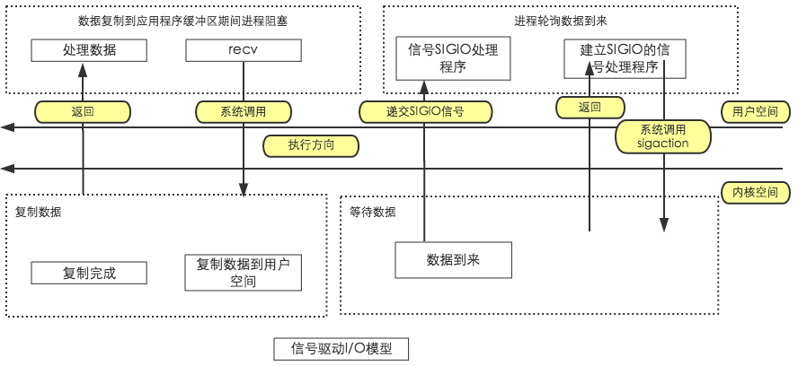
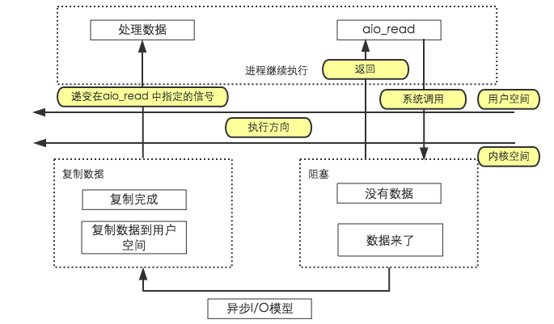

### socket 的概念

```
用户进程：应用层的操作，工作在用户空间
内核：TCP/IP 协议栈 除了应用层，都属于内核的一部分
socket(套接口)：用户进程与内核网络协议栈的编程接口。
用于进程间通信，(属于全双工通信)，可以用于网络上不同的主机进程间通信。[不去关心底层传输的细节]
异构系统通信：软件平台不一样，硬件也不一样(PC和手机)。
```

IPv4套接口地址结构
```c++
// IPv4 套接口地址结构通常也称为"网际套接字地址结构",以"sockaddr_in"命名，定义在<netinet/in.h> 中
struct sockaddr_in{
    uint8_t sin_len;
    sa_family_t sin_family;
    in_port_t sin_port;
    struct in_addr sin_addr;
    char sin_zero[8];
}
/*
* sin_len: 整个sockaddr_in结构体的长度，在4.3BSD-Reno版本之前的第一个成员是sin_family
* sin_family:指定该地址家族，不仅能使用在TCP/IP协议。设置为AF_INET表示IPv4协议，设置为AF_INET6表示IPv6协议
* sin_port: 端口，2字节
* sin_addr: IPv4地址，4字节
* sin_zero: 暂不使用，一般将其设置为0
*/
```

通用的地址结构
```c++
// 用来指定与套接口关联的地址，任何协议
struct sockaddr{
    uint8_t sin_len;
    sa_family_t sin_family;
    char sa_data[14];
}
/*
* sin_len: 整个sockaddr结构体的长度
* sin_family: 指定该地址家族
* sa_data: 由sin_family决定它的形式
*/
```

网络字节序
```c++
// 0x12345678 -> 12 34 56 78 [大端字节序] -> 78 56 34 12 [小端字节序]
大端字节序(Big Endian)：最高有效位存储于最低内存地址，最低有效位存储于最高内存地址
小端字节序(Little Endian)：最高有效位存储于最高内存地址，最低有效位存储于最低内存地址
主机字节序：不同的主机有不同的字节序。可能为 大端字节序 也可能为 小端字节序
网络字节序：规定为 大端字节序
HostA->[主机字节序转换为网络字节序]->[网络传输]->[网络字节序转换为主机字节序]->HostB
```

字节序转换函数(byteorder)
```c++
uint32_t htonl(uint32_t hostlong); // htonl h(主机字节序) to(转换为) n(网络字节序) l(long)  主机字节序转换位网络字节序
uint16_t htons(uint16_t hostshort);
uint32_t ntohl(uint32_t netlong); // ntohl n(网络字节序) to(转换为) h(主机字节序) l(long) 网络字节序转换为主机字节序
uint16_t ntohs(uint16_t netshort);

/*说明：
    h 代表 host
    n 代表 network
    s 代表 short
    l 代表 long   
*/
```

地址转换函数
```c++
#include <netinet/in.h>
#include <arpa/inet.h>

int inet_aton(const char *cp, struct in_add *inp); // 将点分十进制IP转换成网络字节序地址，和 inet_addr 一样，参数不同
in_addr_t inet_addr(const char *cp); // 将点分十进制IP转换为32位整数
char *inet_ntoa(struct in_addr in); // 将地址结构转换为点分十进制的IP地址
```

套接字类型
```c++
流式套接字(SOCK_STREAM): // TCP协议
    面向连接、可靠数据传输、数据无差错、无重复发送、按发送顺序接收
数据报式套接字(SOCK_DGRAM):
    无连接服务、不提供无错保证、数据可能丢失或重复、接收顺序混乱
原始套接字(SOCK_RAW):
    跨越传输层，直接对IP层进行封装的套接字
    通过 原始套接字 可以将应用层数据直接封装成 IP 层可认识的协议格式
```





函数
```c++
// 都包含头文件 <sys/socket.h>

socket函数
// 功能：创建一个套接字用于通信
原型：
    int socket(int domain, int type, int protocol);
/*
参数：
    domain：指定通信协议族(protocol family)
    type:指定 socket 类型,SOCK_STREAM、SOCK_DGRAM、SOCK_RAW
    protocol:协议类型
返回值:非负整数，套接字，失败返回 -1
*/

bind函数
// 功能：绑定一个本地地址到套接字
原型:
    int bind(int sockfd, const struct sockaddr *addr, socklen_t addrlen);
/*
参数:
    sockfd: socket 函数返回的套接字
    addr: 要绑定的地址
    addrlen: 地址长度
返回值: 成功返回0，失败返回-1
*/

listen函数
/*
功能: 将套接字用于监听进入的连接

listen 函数应该在调用socket和bind函数之后，调用函数accept之前调用
对于给定的监听套接字，内核要维护两个队列:
    1、已由客户发出并到达服务器，服务器正在等待完成相应的TCP三次握手
    2、已完成连接的队列    
*/
原型:
    int listen(int sockfd, int backlog);
/*
参数:
    sockfd: socket函数返回的套接字。调用listen后，sockfd由主动套接字变成被动套接字
    backlog: 规定内核为此套接字排队的最大连接个数，SOMAXCONN 队列的最大值
返回值:成功返回0，失败返回-1
*/

// 主动套接字: 发起连接 connect
// 被动套接字: 接收连接 accept

accept函数
/*
包含头文件 <sys/socket.h>
功能：从已完成连接队列返回第一个连接，如果已完成连接队列为空，则阻塞
*/
原型:
    int accept(int sockfd, struct sockaddr *addr, socklen_t *addrlen);
/*
参数:
    sockfd: 服务器套接字
    addr: 将返回对等方的套接字地址
    addrlen: 返回对等方的套接字地址长度
返回值: 成功返回非负整数，失败返回-1
*/

connect 函数
// 功能：建立一个连接至addr所指定的套接字

原型:
    int connect(int sockfd, const struct sockaddr *addr, socklen_t addrlen);
/*
参数:
    sockfd: 未连接套接字
    addr: 要连接的套接字地址
    addrlen: 第二个参数addr长度
返回值:成功返回0，失败返回-1
*/
```

socket 函数 (TODO)
```
确定字节数的读取(解决粘包问题1) readn、writen[先接收包体后接受包体]

read、write 与 recv、send
readline 实现
用 readline 实现回射客户/服务器
getsockname、getpeername
gethostname、gethostbyname、gethostbyaddr

管道

僵尸进程：signal

select
```

TCP回射客户/服务器
```
stdin -[fgets]-> {TCP客户端} -[writen]-[readline]-> {TCP服务器}
stdout<-[fputs]- {TCP客户端} -[readline]-[writen]-> {TCP服务器}
```

REUSEADDR
```c++
// 服务器处于 TIME_WAIT(2*MSL)(bind: Address already in use), 无法重新启动。该状态在套接字关闭后约保留 2 到 4 分钟。在 TIME_WAIT 状态退出之后，套接字被删除，该地址才能被重新绑定。所以服务器要设置SO_REUSEADDR，然后可以重新启动
服务器端尽可能使用 REUSEADDR
在绑定之前尽可能调用 setsockopt 来设置 REUSEADDR 套接字选项
使用 REUSEADDR 选项可以使得不必等待 TIME_WAIT 状态消失就可以重启服务器
```



流协议与粘包
```
1、TCP是基于字节流的传输服务，无边界(流协议)   ，不能保证接收方一次读操作能返回多少个字节，多少个消息[不维护消息与消息的边界]   
2、UDP是基于消息的传输服务，传输报文，有边界，能够保证接收方一次读操作能返回多少个字节，多少个消息   
3、所以字节流的TCP会产生粘包问题   
```


### 粘包产生的原因

```
1、应用进程缓冲区大小套接口发送缓冲区(SO_SNDBUF)，就会发生粘包问题，因为消息被分割发送了；   
2、TCP 传输的有最大段(MSS)限制，会对消息进行分割；   
3、链路层所传输的数据有一个最大的传输单元(MTU)限制,所发送的数据大于MTU会在 IP 层进行分组(分片)，可能导致消息分割；   
4、TCP的流量控制(窗口流量)、拥塞控制(?)、延时发送机制...   
```

解决粘包问题
```
本质上是要在应用层维护消息与消息的边界
1、定长包 [导致流量的浪费]   
2、包尾加 \r\n (ftp) [如果 \r\n 是有包数据，则有问题]   
3、包头加上包体长度 [定长的头部+不定长的包体]   
4、更复杂的应用层协议   
```

僵进程与 SIGCHLD 信号

TCP状态

```
11 种状态   
listen:被动套接口   
connect:主动套接口   
 
1、LISTEN: 监听   
2、SYN_SENT: 发起连接   
3、SYN_RCVD:   
4、ESTABUSHED:连接  
5、FIN_WAIT_1:  
6、FIN_WAIT_2:  
7、CLOSE_WAIT:  
8、LAST_ACK:  
9、CLOSING: 特殊的状态，产生的原因是双方同时关闭(双方都调用close,双方都处于FIN_WAIT_1，然后都接收到对方的关闭消息时，会处于CLOSING,然后在接收到ACK 后都处在 TIME_WAIT)   
10、TIME_WAIT: 2*MSL(2倍生存时间，确保可以重传 ACK)，主动关闭方会产生的   
11、CLOSED: 关闭  

TIME_WAIT 与 SO_REUSEADDR
服务器处于 TIME_WAIT(2*MSL)(bind: Address already in use), 无法重新启动。该状态在套接字关闭后约保留 2 到 4 分钟。在 TIME_WAIT 状态退出之后，套接字被删除，该地址才能被重新绑定。所以服务器要设置SO_REUSEADDR，然后可以重新启动
```


产生 SIGPIPE 的原因(管道)
```
1、往一个 已经接收 FIN 的套接字中写是允许的，接收到 FIN 仅仅代表对方不再发生数据。如果发生数据给对方，对方进程不存在时，会发生TCP 重置，对方的TCP协议栈会发送 RST TCP段。   
2、在接收 RST 段之后，如果再调用 write 就会产生 SIGPIPE 信号，对于这个信号的处理我们通常忽略即可
```


### 五种 I/O 模型
阻塞I/O
   
```
1、完成连接后，接收数据，向系统提交 [A]recv 请求(阻塞的请求)，[B]等待接收数据；   
2、[C]直到对方发送数据过来，填充recv这个套接口所对应的接收缓冲区，才解除阻塞。   
3、[C]将这些数据从内核空间(套接口所对应的接收缓冲区)，拷贝到用户空间缓冲区(buf)[D];   
4、[F]recv 返回给用户空间，处理数据。   
```

非阻塞I/O
 
```
1、调用 recv,套接字将其设置为非阻塞模型[fcntl(fd, F_SEIFL, flag|O_NONBLOCK)]；
2、调用recv，即使没有数据到来也不会发生阻塞，会返回错误，返回值为-1，错误代码为EWOULDBLOCK；
3、再次 调用 recv，直到有数据到来；
4、将数据从内核空间拷贝到用户空间
5、拷贝完成返回。 

应用层面比较窄，在数据没有到来时，不断的循环接收数据，直到数据到来，对CPU 资源造成浪费，称 忙等待 (不推荐使用)
```

I/O复用(select 和 poll) 

```
1、用select 来管理多个文件描述符，一旦其中的一个或多个文件描述符检测有数据到来，select 就返回。然后调用 recv 就不会阻塞。将数据从内核空间拷贝到用户空间。
2、阻塞的位置提前到了 select
```

信号驱动I/O (不常用)
  
```
1、系统调用sigaction来安装信号处理程序，安装完后程序可处理其他任务，不阻塞
2、有数据到来，则以信号的方式来通知应用程序
3、应用程序跳转到信号处理程序中，调用 recv 来接收数据
4、将数据从内核空间拷贝到用户空间
```

异步I/O(效率最高)  
 
```
1、使用 aio_read 函数来实现的，这个函数提交一个请求，并且提交一个应用层缓冲区 buf。即使内核中没有数据到来，这个函数也立刻返回，一旦返回之后，应用进程就可以出来其他的事情。
2、当有数据到来之后，内核自动将这些数据拷贝到应用层的缓冲区，也就是之前的buf。
3、一旦拷贝完成，就可以通过一个信号，来通知应用进程的程序，处理数据

和信号驱动IO的不同：
内核一旦接受到数据，则会主动的将数据返回给用户指定的缓冲区中(自动推送)。
也就没有必要调用 recv 方法去接受数据，而是信号通知用户可以出来数据了。
是一旦应用程序得到信号，实际上已经将数据从内核拷贝到用户空间了
信号驱动IO只是收到内核已经接受到数据的信号，然后用 recv 去取(拉操作)
```

select(中心管理者)
```
可以管理多个IO，一旦某个IO或多个IO发生关注的事件，则select 立即返回，并返回事件的个数。并且返回哪里I/O发生事件，遍历事件，处理事件
```

读、写、异常事件发生的条件
```
可读：
    套接口缓冲区有数据可读
    连接的读一半关闭,即接收到 FIN 段，读操作将返回0
    如果监听套接口，已完成连接队列不为空时。
    套接口上发生了一个错误待处理，错误可以通过getsockopt指定 SO_ERROR 选项来获取
可写：
    套接口发送缓冲区有空间可容纳数据
    连接的写一半关闭,即接收到 RST 段，再次调用 write 操作
    套接口上发生了一个错误待处理，错误可以通过getsockopt指定 SO_ERROR 选项来获取
异常：
    套接口存在外带数据
```































































































































end