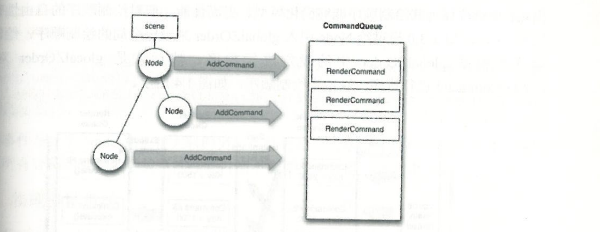
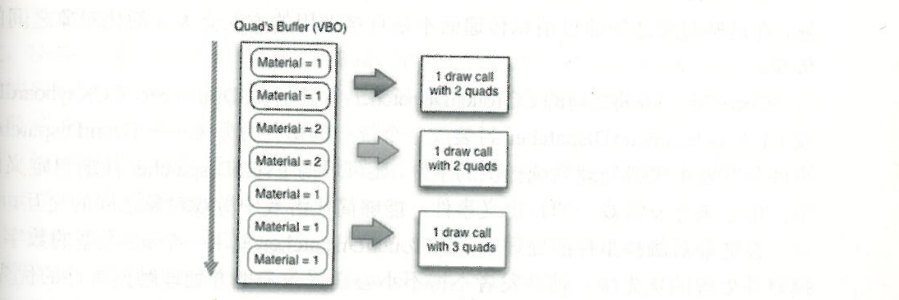
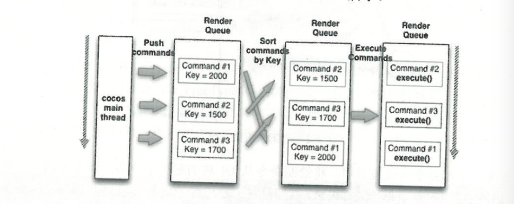

## Cocos2d-x 3.0 的新特性

### 命名
---------------
- 3.0版本之前一直保持与Cocos2d-iPhone一致的Objective-C 接口风格，例如类名的"CC"前缀、sharedXXX()的单例命名和属性使用等。

> CCSprite被更名为Sprite等。<br />
> 一些全局方法也被加入相应的命名空间中，如与绘制几何基元相关的方法被加入 DrawPrimitves 命名空间，与 OpenGL ES 相关的命名空间。

```c++
    v2.x                 v3.x
    CCSprite            cocos2d::Sprite
    ccDrawPoint()       DrawPrimitives::drawPoint()
    ccGLBlendFunc()     GL::blendFunc()
```

> 用 getInstance() 和 destroyInstance() 方法代替 sharedXXX() 和 endXXX() 方法来使用单例。

```c++
    v2.x                        v3.x
CCDirector::sharedDirector()    Director::getInstance()
CCDirector::endDirector()       Director::destroyInstance()
```

> 在 v3.x中，TextureCache、Dispatcher 等对象不再是全局的单例，它们属于 Director,通过Director来获取其实例。 <br />
> 使 v3.x 可以支持多个窗口，即多个 Director, 如 auto tc = Director::getInstance()->getTextureCache() <br />
> 使用 get 前缀来表示属性获取方法

```c++
    v2.x                                v3.x
node->boundingBox()                 node->getBoundingBox()
sprite->nodeToParentTransform()     sprite->getNodeToParentTransform()
```

> 属性获得方法使用 const 声明来限制其对自身属性的修改

```c++
// v2.x
virtual float getScale();

// v3.x
virtual float getScale() const;
```

> 对于POD类型，使用引用参数来代替指针传递(包括 TexParams、Point、Size等)，这些对象被分配到栈中，更易于内存的管理。

```c++
// v2.x
void setTexParamenters(ccTexParams* texParams);

// v3.x
void setTexParameters(const ccTexParams& texParams);
```

- 使用 clone() 代替 copy() 方法: clone() 方法用来深度复制一个对象

> 与 copy() 方法不同的是，对于Cocos2d-x系统提供的可复制的对象，clone() 方法直接返回一个加入自动回收池的对象，调用者不再需要手动将其加入自动回收池，减少类型转换的时间。

```c++
    // v2.1
    CCMoveBy *action = (CCMoveBy*) move->copy();
    action->autorelease();

    // V3.O
    auto action = move->clone(); // 直接返回 autorelease 对象，不需要类型转换
```

- v3.x使用了部分 C++11的特性，主要包括 std::function、强类型枚举、std::thread、override和final关键字、移动语义等

> std::function 可以被传递一个 lambda 表达式，亦可以通过 std::bind 绑定一个方法指针，提升可读性和灵活性。同时lambda表达式还可以使用当前作用域中的变量。

```c++
// 创建一个CallFunc对象
CallFunc::create([&](){
        auto sprite = Sprite::create("sp.png");
        this->addChild(sprite);
    });
```

- v2.x 用k前缀来表示枚举和常量。由于这些参数可以被int型变量替换，会造成难以察觉的错误，v3.x使用强类型枚举来避免这种情况

```c++
    v2.x                                v3.x
 kCCTexture2DPixelFormat_RGBA8888   Texture2D::PixelFormat::RGBA8888
 kCCDirectorProjectopnCustom        Director::Projection::CUSTOM
 ccGREEN                            Color3B::GREEN
 CCPointZero                        Point::ZERO
 CCSizeZero                         Size::ZERO
```

- override 用来在编译时检测一些可能的重载错误

> 当一个方法被声明为 override 关键字时，必须能在其父类中找到相应的可重载方法，否则编译器将产生错误

```c++
class Sprite : public Node{
    // Overrides
    virtual void setTexture(Texture2D *texture) override;
}
```

### 跨平台的Label
---------------
- OpenGLES 不直接提供对文字的支持，因此游戏中一般都要通过绘制纹理来显示字体。
- v2.x 通过向每个平台索要一张 完整的一段文字 的纹理，然后直接绘制该纹理，这使每个字符缺乏足够的描述信息。

> 没有使用各种文字效果(如描边、加粗等特效) 的简便方法  <br />
> 每段不同的文字都会生成一张纹理，也使文字绘制的性能变得很差

- v3.x 使用开源的 FreeType 字体库来解析文字和生成纹理

> FreeType 不仅生成一段文字对应的纹理，还会返回该纹理中每个字形的定义，如在纹理中的位置、ID、不同字形间组合的间距等字形信息。<br />
> 这样不仅能通过着色器给每个文字添加不同的特效，还能多个文字共享一张纹理，提升绘制效率。<br />
> v3.x改善了字体的接口设计，使LabelTTF、LabelBMFont、LabelAtlas 拥有相同的属性及使用方法。他们唯一区别只是通过不同的方式生成或加载纹理。<br />
> 不依赖平台

### 渲染
---------------
- 在一般的3D应用程序中，OpenGL 渲染管线可以根据片段的深度来正确处理场景中的元素层级，只需要处理透明与非透明的绘制顺序即可。2D应用程序中，每个元素通常具有相同的深度，Cocos2d-x给每个元素指定一个逻辑深度，并按照这个深度对UI元素进行排序，游戏中的每一帧只需要对UI树做一个 深度优先遍历，就可以按照正确的顺序绘制整个场景，除了渲染，在每一帧上几乎没有额外的计算工作，因此能够比较高效地执行渲染工作

> 这套架构设计不易于扩展，过时。<br />
> 例如: 开发者无法修改一个元素在全局的层级，每个元素都按照UI树的结构绘制，不能在父级或子级之间变更层级。由于每个元素(如Sprite)负责自己的绘制，所以不易针对绘制做更好的优化。<br />
> 例如：相邻的两个元素使用了相同的纹理和相同的 OpenGL ES 绘制参数，但是仍然需要单独绘制两次。

- Cocos2d-x 3.0 重新设计了渲染机制，将渲染从UI树遍历中分离出来，这不仅使其架构更灵活、更易于拓展，还可以针对渲染进行优化(如自动批绘制技术)。新的渲染架构设计提升了引擎的性能与灵活性。

- 主线程的每一帧遍历UI树的每一个元素时，并不直接调用OpenGL ES 进行绘制，而是将 每个元素的绘制命令 包装成一个 RenderCommand 对象发送至绘制栈，绘制栈在遍历场景中的每一个元素之后开始绘制。


> Cocos2d-x 提供 QuadCommand、GroupCommand、BatchCommand 及自定义绘制命令 CustomCommand。好处如下: 

1.绘制命令可以被重用。
>   将绘制命令从UI树的遍历中分离，多个不同的元素就可以使用相同的绘制命令进行组合，使得对引擎维护更灵活。例如:Label、Particle及TileMap都使用BatchCommand进行绘制。

2.由于所有绘制命令被集中处理，渲染系统就可以做一些优化工作。
>   例如:对于相邻的绘制命令，如果它们使用相同的RenderCommand类型，并且使用相同的纹理及OpenGL ES绘制参数，渲染系统就可以把它们合并成一次绘制。减少绘制次数能提升渲染性能，这在Cocos2d-x 3.x 中称为自动批绘制技术(auto-batching)。<br />
如果有一个场景中有100个Sprite，且它们来自同一张纹理，那么在理想的情况下，只需要进行一次OpenGL ES 绘制命令调用。


3.这些命令虽然按照UI树结构的顺序发送到绘制栈，但是绘制栈在开始绘制时完全可以对其绘制顺序重新排序，使其可以用不同于UI树结构的绘制顺序。
> UI树更多决定的是一种元素的坐标系变换。<br />
> 在3D游戏中，每个元素的绘制顺序是由其Z值决定的。2D游戏中的所有元素通常使用相同的Z值，使用UI树结构作为其绘制顺序能够简化模型、提高性能，但对绘制顺序的自由性有很大限制。<br />
> Cocos2d-x 3.x 通过给 Node 引人 globalZOrder 来设定全局的绘制顺序，绘制栈则会优先根据 globalZOrder 中的设定进行排序，然后才是 glocalZOrder 对所有 RenderCommand 进行排序，以决定绘制顺序。<br />


4. Cocos2d-x 3.x 还为 Sprite 引人自动裁剪技术(auto-culling),所有处于游戏视窗外的Sprite根本不会发送绘制命令到绘制栈，减少不必要的OpenGL ES 绘制调用。


END