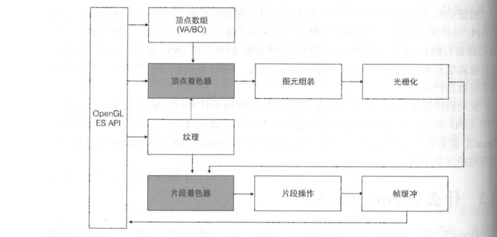
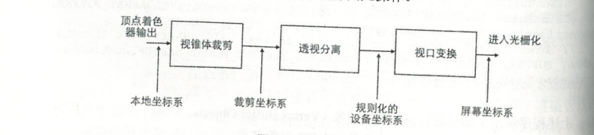
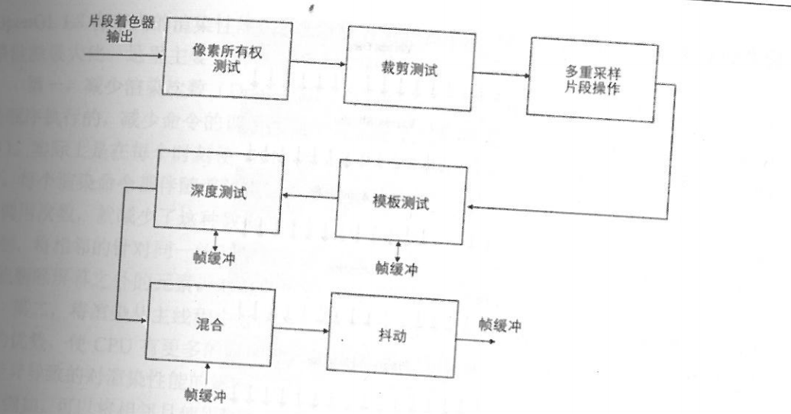

# OpenGL ES 2.0

> 游戏引擎对开发者提供一组UI元素，以及组织这些UI元素构成游戏场景的接口。<br />
> 游戏引擎内部，将这些UI元素转化为一系列OpenGL ES 命令的调用，并在每一帧中将场景绘制到设备屏幕上。

理解CPU和GPU(图形处理器 Graphics Processing Unit)之间的区别的一个简单方式就是对比它们如何处理任务

> CPU 由专门为顺序串行处理而优化的几个核心组成，而GPU则由数以千计的更小、更高效的核心组成，这些核心专门为同时处理多任务而设计。
> 
> 衡量GPU的性能高低的一个重要术语是每秒像素填充率(Pixels Per Second),它是指GPU每秒所渲染的像素数量，单位为MPixel/s(每秒100万像素)或GPixel/s(每秒10亿像素)

```
图片模型-[转化乘]->一组图元 
每个图元-[由..组成]->一个或多个顶点
每个顶点:
    定义一个点、一条边的一端或者三角形的一个角,
    关联一些数据，这些数据包括顶点坐标、颜色、法向量及纹理坐标等
```

- 概念
OpenGL ES是一套图形硬件的软件接口，它直接和GPU进行交互，使我们可以创建实时的3D图形程序，如游戏、视频等。

> OpenGL ES 是桌面版 OpenGL 图形库的一个子集，通常用在嵌入式和手持设备中，如智能手机、平板电脑和掌机等。

OpenGL ES 的全部功能都集中在怎样将程序定义的各种2D或3D模型绘制到帧缓存中，或者如何将数据从帧缓存中读取到程序中，如保存一张场景截图。不提供其他与硬件相关的功能(音频、键盘输入)

- OpenGL ES 2.0 渲染管线

OpenGL ES 的主要作用是将3D场景绘制到2D屏幕上，在图形学上，这一过程通过一系列的渲染管线完成。

> OpenGL ES API 就是用来向各个阶段提供一些数据和状态指令，以使渲染管线能够按照要求正确地将物体绘制在屏幕上的。



> 上图 <br />
> 1-左边的客户端程序通过调用OpenGL ES 接口，将顶点、着色器程序、纹理，以及其他GL状态参数传入右边的GL服务端。<br />
> 2-然后在客户端调用绘制命令(如 DrawArray),GL便会对输入的图元逐一执行渲染管线的每个阶段。<br />
> 3-然后将每个像素的颜色值写入帧缓冲(Framebuffr)中。<br />
> 4-最后，视窗系统就可以将帧缓冲的颜色值显示在屏幕上。<br />
> 5-此外，应用程序也可以从帧缓冲将数据读取到客户端。

在整个管线中，顶点着色器(Vertex Shader)和片段着色器(Fragment Shader)是可编程的部分，应用程序可以通过提供着色器程序达到GPU中被作用于渲染管线的目的，而在其他阶段则只能使用一些固定的GL命令影响该阶段的执行。

1、顶点数组

OpenGL ES 并不提供对3D模型的定义。 <br />
在传入OpenGL ES 之前，应用程序应该将3D模型转换为一组图元(Primitives)的集合。每个图元都是一个点、线段或者三角形。 <br />
每个模型是独立绘制的，修改其中一个模型的一些设置不会影响其他模型。<br />
OpenGL 会确保发送到服务端的命令按顺序执行。

> 每个图元有一个或多个顶点(Vertices)组成，每个顶点定义一个点、一条边的一端或者三角形的一个角。<br />
> 每个顶点关联一些数据，这些数据包括顶点坐标、颜色、法向量及纹理坐标等。 <br />
> 所有这些顶点的相关信息构成顶点数组，这些数据被上传到GL服务端后就可以进行绘制了

```c++
    /**
        如何通过顶点缓冲对象(Vertex Buffer Objects, VBO)绑定顶点数组数据。
        glGenBuffers() 方法分配了指定个数的VBO对象名称，
        这里分配两个缓冲对象，一个用来存储顶点数组，另一个用来存储每个顶点的索引值。
        glBindBuffer 设置当前缓冲对象，之后的glBufferData 则会将绑定到当前缓冲对象。
        这样，在开始绘制一个模型前，我们就将顶点信息传入OpenGL ES 渲染管线。
    */
    void initVertexBufferObjects(vertex_t* vertexBuffer, GLushort* indices, GLuint numVertices, GLuint numIndices, GLuint* vboIds)
    {
        glGenBuffers(2, vboIds);
        glBindBuffer(GL_ARRAY_BUFFER, vboIds[0]);
        glBufferData(GL_ARRAY_BUFFER, numVertices*sizeof(vertex_t), vertexBuffer, GL_STATIC_DRAW);

        //bind buffer object for element indices glBindBuffer(GL_ELEMENT_ARRAY_BUFFER, vboIds[1]);
        glBufferData(GL_ELEMENT_ARRAY_BUFFER, numIndices*sizeof(GLushort), indices, GL_STATIC_DRAW)
    }
```

> OpenGL ES 中的命令总是按照它接收的顺序执行，这意味着一组图元必须全部绘制完毕才会开始绘制下一组图元，同时也意味着程序对帧缓冲的像素的读取结果一定是该命令之前所有OpenGL 命令执行的结果。

2、顶点着色器

顶点着色器是一段类似C语言的程序，由程序员提供并在GPU上执行，对每个顶点执行一次运算。

> 顶点着色器可以使用顶点数据来计算该顶点的坐标、颜色、光照、纹理坐标等。 <br />
> 在渲染管线中，每个顶点都独立地被执行。

顶点着色器最重要的任务是执行顶点坐标变换，应用程序中设置的图元顶点坐标通常是针对本地坐标系的。<br />
本地坐标系简化了程序中的坐标计算，但是GL并不识别本地坐标系，所以在顶点着色器中，要对本地坐标执行模型视图变换，将本地坐标转换为裁剪坐标系(Clip Coordinate)的坐标值。<br />
顶点着色器用于输入顶点在裁剪坐标系中的坐标的变量为gl_Position。<br />
顶点着色器的另一个功能是向后面的片段着色器提供一组易变(Varying)变量。<br />
易变变量会在图元装配阶段之后被执行插值计算。如果是单一采样，其插值点为片段的中心；如果是多重采样，其插值点可能为多个采样片段中的任意一个位置。<br />
易变变量可以用来保存插值计算片段的颜色、纹理坐标等信息。

3、图元装配

在顶点着色器程序输出顶点坐标之后，各个顶点按照绘制命令(DrawArrays 或 DrawElements)中的图元类型参数及顶点索引数组被组装乘一个个图元



在图元装配阶段，顶点坐标会经过多个坐标系的变换

> 顶点数组首先通过GL命令输入GL渲染管线中，此时，顶点坐标位于应用程序的本地坐标系。<br />
> 经过顶点着色器的计算之后，顶点坐标被转换为剪裁坐标系的坐标，这通常通过向顶点着色器传入一个模型视图变换矩阵，然后在顶点着色器中执行坐标变换实现。

裁剪坐标系被定义在一个视锥体剪裁的控件里。视锥体是游戏场景中的一个可视空间，由6个剪裁平面构成，分别是近平面、远平面、左平面】右平面、上平面、下平面，处于视锥体以外的图元将被丢弃<br />
如果该图元与视锥体相交，则会发生剪裁，产生新的图元。

> 注意: 透视裁剪是一个比较影响性能的过程，因为每个图元都需要和6个面进行相交计算并产生新的图元。<bt />
> 但是，一般在X轴、y轴方向超出屏幕(由glViewport定义)的部分，则无须产生新的图元，这些顶点能在视口变换时被更高效地丢弃。

> 视锥体在3D应用程序中通常表现为一个摄像机，其观察点为裁剪坐标的原点，方向为穿过远近平面的中点。<br />
> 可以通过 gluPerspective 来定义视锥体的结构，通过 gluLooAt 来定义观察点的位置，它们组合在一起就构成了一个裁剪坐标系。

在Cocos2d-x中，Director的setProjection()方法定义了视锥体

```c++
    void Director::setProjection(Projection projection)
    {
        Size size = _winSizeInPoints;
        setViewPort();

        switch(projection)
        {
            case Projection::_3D:
            {
                float zeye = this->getZEye();
                Mat4 matrixPerspective, matrixLookup;

                loadIdentityMatrix(MATRIX_STACK_TYPE::MATRIX_STACK_PROJECTION);

                // issue #1334
                Mat4::createPerspective(60,(GLfloat)size.width/size.height, 10, zeye+size.height/2, &matrixPerspective);
                multiplyMatrix(MATRIX_STACK_TYPE::MATRIX_STACK_PROJECTION, matrixPerspective);

                Vec3 eye(size.width/2, size.height/2, zeye), center(size.width/2, size.height/2, 0.0f), up(0.0f, 1.0f, 1.0f);
                Mat4::creatLookAt(eye, center, up, &matrixLookup);
                multiplyMatrix(MATRIX_STACK_TYPE::MATRIX_STACK_PROJECTION, matrixLoopup);

                loadIdentityMatrix(MATRIX_STACK_TYPE::MATRIX_STACK_MODELVIEW);
                break;    
            } 
        }

        _projectio = projection;
        GL::setProjectionMatrixDirty();

        _eventDispatcher->dispatchEvent(_eventProjectionChanged);
    }
```

> 在 setProjection()中，定义了一个张角为60度、视口比例为屏幕宽高比、近平面距离为10、远平面距离为 zeye+size.height/2的视锥体，摄像机位于屏幕向后zeye的距离。<br />
> 在3D应用程序中，可以通过修改摄像机的位置和方向，产生不同位置和角度的视锥体，以达到移动摄像机的效果。<br />
> 相同的过程也可以通过反向移动物体位置实现。

> 经过视锥体裁剪后的顶点坐标经过透视分离(Perspective Division)投影到屏幕或视口(viewport)上，称为规则化(Normalized)的设备坐标系,这些坐标值的取值范围为[0,1]

> 最后，规则化的坐标(Xd,Yd,Zd) 经过视口变换(Viewport Transformation)转换为屏幕坐标，其视口的位置和尺寸通过命令"void glViewPort(GLint x, GLint y, GLsizei w, GLsizei h)" 定义。其中(x,y)定义视口在屏幕左下角的位置，(w,h)定义视口的大小，它们的单位均为像素。

> 通过坐标变换，图元的顶点坐标最终被转换到屏幕上。<br />
> 注意: 在视口变换中，[-1,1]的值被转换到视口上，所以，视锥体定义的远近平面的比较应该与视口保持一致，否则会导致图元变形。

4、光栅化

> 通过图元装配，所有3D图元已经转换为屏幕上的2D图元。

光栅化的主要作用是将2D图元转换为一系列的片段(Fragment),并计算每个片段的位置。<br />
每个片段会执行一次片段着色器程序，在片段着色器中使用光栅化计算出的片段位置给每个片段着色，各个片段执行器的执行仍然是并行的。

> 在光栅化之前，要判断图元是面向观察者还是背向观察者，以决定是否需要丢弃图元。<br />
> 可以通过glFrontFace 命令来决定哪个方向为正，并通过 glCullFace命令来决定需要保留哪一面。<br />
> 这样做的好处是可以减少一些不必要的绘制，并减少对CPU的浪费。

光栅化的过程主要是对图元中的片段进行采样，以决定哪些片段位于图元之内。 <br />
在这个过程中，因为这些片段的坐标值为离散的整数，所以会导致精度的损失，如图元边沿产生锯齿，而光栅化会使用各种算法来保证每个片段的位置尽可能精确。

> 在计算出每个片段的坐标值后，片段着色器就能使用这个坐标值对该片段进行着色了，这个片段为最终屏幕上的一个像素点。<br />
> 此外，光栅化还需要计算那些在顶点着色器中定义的易变变量的插值，这些值最终被用在片段着色器中，以计算片段最终的颜色值，如片段的纹理坐标、颜色等。

5、片段着色器(Fragment Shader)

可编程的片段着色器是实现一些高级特效(如纹理贴图、光照、环境光、阴影等功能)的基础。<br />
片段着色器的主要作用是计算每一个片段的颜色值(或者丢弃该片段)

> 片段着色器可以根据顶点着色器输出的顶点纹理坐标对纹理进行采样，以计算该片段的颜色值，这些值最后被写入帧缓冲。<br />
> 由于在实际贴图过程中可能会涉及放大和缩小以及纹理超出(0,0)和(1,1)之间的问题。<br />
> 为了处理这些问题，一般在绑定纹理时，可以通过glTexParameter()方法来设置纹理相关的一些处理模式，例如多级纹理。
> 
> 片段着色器也是执行光照等高级特效的地方。例如，传给片段着色器一个光源位置和光源颜色，根据一定的公式计算出一个新的颜色值，这样就可以实现光照特效了。

6、片段测试

片段着色器输出的颜色值还要经过几个阶段的片段操作，这些操作可能会修改片段的颜色值或者丢弃该片段，最终的片段颜色值会被写入帧缓冲区。<br />
这些步骤包括像素所有权测试、裁剪测试、模板测试、深度测试、混合、抖动。



> 像素所有权测试用来判断帧缓冲区中该位置的像素是否属于当前OpenGL ES。例如，在窗口系统中该位置可能会被其他应用程序窗口遮挡，此时该像素则不会被显示<br />
> glScissor 用于设定一个矩形区域，以执行裁剪测试，处于该区域之外的片段会被丢弃。<br />
> 在完成片段测试后，要么丢弃片段，要么将每个片段对应的颜色、深度、模板值写入帧缓冲区，最终呈现在设备的屏幕上。帧缓冲区中的颜色值也可以被读回到客户端应用程序中，这样可以实现绘制到纹理的效果。


- 渲染管线中的并行计算

> OpenGL ES 总是按顺序执行命令，这意味着一个物体必须全部绘制完成才会开始绘制下一个物体，这样能保证在任何情况下，屏幕上显示的都是正确的图像。然而，在一个管道的各个阶段，所有处理则并行的，这样保证了实时显示的性能。

这里的并行有两个方面:

> 一个方面是纵向的并行:<br />
> 是指在每个阶段内部被拆分成多个子任务，这些子任务像工厂里的流水线一样并行处理。<br />
> 另一方面是横向的并行: <br />
> 即多个顶点、多个图元、多个片段都是独立并行处理的，提高了渲染性能。

因为每个顶点、图元及片段被并行处理，所以它们没有任何状态

> 例如，在顶点着色器程序中，我们不知道下一个要处理的顶点是什么，所有顶点着色器和片段着色器中的变量都必须通过程序获取(attribute和uniform)，或者通过光栅化阶段的插值计算(varying)

OpenGL ES 是一个状态机，管道中的很多操作都是需要依赖当前特定的状态值，如是否执行深度测试，这些状态会影响管道中的所有顶点、图元、片段的执行。这样做能保证并行行计算，从而实现更高效的绘制。


- 构建高性能的渲染引擎

1、减少渲染次数(Draw Call)

> 多个绘制命令之间是顺序执行的，减少命令的调用次数(其实现方式是将更多的顶点包装到一个顶点数组中)。<br />
> 实际上是在每个时刻使GPU做更多的事情(同一管道内的顶点并行执行)。<br />
> 同时，每个渲染命令都伴随着顶点、纹理数据从客户端复制到客户端的过程，减少渲染命令调用次数，就减少了这种数据的传输。<br />
> Cocos2d-x在这方面的处理方式是使用自动批绘制，将相邻的针对同一绘制参数的绘制命令合并在一起进行绘制，以及使用自动裁剪功能删除屏幕之外的元素。

2、将渲染从主线程中分离

> 这样做不仅能充分运用现代CPU多处理器、多线程的优势，使CPU有更多的时间处理游戏逻辑，还能避免CPU和GPU之间处理速度的差异导致的对渲染性能的影响。<br />
> 同时，统一处理所有绘制命令还可以集中进行一些优化。例如，可以将相邻且使用同一纹理的绘制命令合并到一起，减少DrawCall次数。


- 帧缓冲

> OpenGL ES 渲染管道最终的目的是将每个像素的颜色、深度、模板等数据输送到帧缓冲(Framebuffer)区。

帧缓冲中存储着OpenGL ES 绘制的每个像素点的所有最终信息，包括颜色、深度和模板值。

> 一个帧缓冲上有3个对应的附加点，它们组成了一个逻辑缓冲区，分别用来存储所有像素的颜色、深度和模板数据。<br />
> 每个附加点可以绑定到一个渲染缓冲对象(Renderbuffer Objects)上，其中颜色和深度附加点还可以绑定到一个纹理上，这样就可以实现绘制到纹理，而不是显示设备了。

帧缓冲通常由视窗系统提供，也可以通过应用程序创建。<br />
应用程序可以将不同的内容绘制到不同的帧缓冲中。<br />
在多个帧缓冲之间切换时不需要切换OpenGL ES 的上下文，通常可以使用此方式来高效地将内容绘制到纹理。(参考Cocos2d-x的RenderTexture类)

> 只有将内容绘制到视窗提供的帧缓冲中，才能将内容输出到显示设备上。<br />
> 视图系统提供的帧缓冲的颜色缓冲区通常由两个缓冲对象组成，分别是一个前端缓冲和一个后端缓冲。<br />
> OpenGL ES 将所有内容首先绘制后端缓冲区，然后在每一帧绘制完成后一次性通过交换前后缓冲区将内容显示在屏幕上。<br />
> 之后，前端缓冲变成后端缓冲，而后端缓冲变成前端缓冲。<br />
> 之所以设计成双缓冲区，是因为如果直接绘制到设备屏幕上，用户会看到一个完整的场景中的物体被一个一个地绘制出来的过程。


END