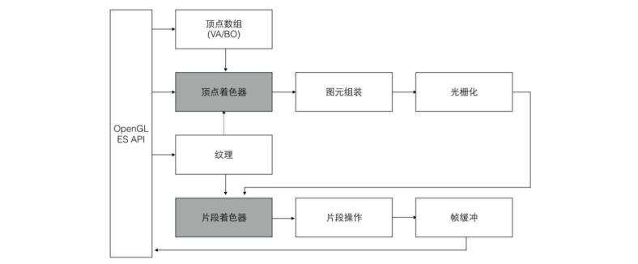

# OpenGL ES 2.0

> 游戏引擎对开发者提供一组UI元素，以及组织这些UI元素构成游戏场景的接口。<br />
> 游戏引擎内部，将这些UI元素转化为一系列OpenGL ES 命令的调用，并在每一帧中将场景绘制到设备屏幕上。

理解CPU和GPU(图形处理器 Graphics Processing Unit)之间的区别的一个简单方式就是对比它们如何处理任务

> CPU 由专门为顺序串行处理而优化的几个核心组成，而GPU则由数以千计的更小、更高效的核心组成，这些核心专门为同时处理多任务而设计。
> 
> 衡量GPU的性能高低的一个重要术语是每秒像素填充率(Pixels Per Second),它是指GPU每秒所渲染的像素数量，单位为MPixel/s(每秒100万像素)或GPixel/s(每秒10亿像素)

```
图片模型-[转化乘]->一组图元 
每个图元-[由..组成]->一个或多个顶点
每个顶点:
    定义一个点、一条边的一端或者三角形的一个角,
    关联一些数据，这些数据包括顶点坐标、颜色、法向量及纹理坐标等
```

- 概念
OpenGL ES是一套图形硬件的软件接口，它直接和GPU进行交互，使我们可以创建实时的3D图形程序，如游戏、视频等。

> OpenGL ES 是桌面版 OpenGL 图形库的一个子集，通常用在嵌入式和手持设备中，如智能手机、平板电脑和掌机等。

OpenGL ES 的全部功能都集中在怎样将程序定义的各种2D或3D模型绘制到帧缓存中，或者如何将数据从帧缓存中读取到程序中，如保存一张场景截图。不提供其他与硬件相关的功能(音频、键盘输入)

- OpenGL ES 2.0 渲染管线

OpenGL ES 的主要作用是将3D场景绘制到2D屏幕上，在图形学上，这一过程通过一系列的渲染管线完成。

> OpenGL ES API 就是用来向各个阶段提供一些数据和状态指令，以使渲染管线能够按照要求正确地将物体绘制在屏幕上的。



> 上图 <br />
> 1-左边的客户端程序通过调用OpenGL ES 接口，将顶点、着色器程序、纹理，以及其他GL状态参数传入右边的GL服务端。<br />
> 2-然后在客户端调用绘制命令(如 DrawArray),GL便会对输入的图元逐一执行渲染管线的每个阶段。<br />
> 3-然后将每个像素的颜色值写入帧缓冲(Framebuffr)中。<br />
> 4-最后，视窗系统就可以将帧缓冲的颜色值显示在屏幕上。<br />
> 5-此外，应用程序也可以从帧缓冲将数据读取到客户端。

在整个管线中，顶点着色器(Vertex Shader)和片段着色器(Fragment Shader)是可编程的部分，应用程序可以通过提供着色器程序达到GPU中被作用于渲染管线的目的，而在其他阶段则只能使用一些固定的GL命令影响该阶段的执行。

1、顶点数组

OpenGL ES 并不提供对3D模型的定义。 <br />
在传入OpenGL ES 之前，应用程序应该将3D模型转换为一组图元(Primitives)的集合。每个图元都是一个点、线段或者三角形。 <br />
每个模型是独立绘制的，修改其中一个模型的一些设置不会影响其他模型。<br />
OpenGL 会确保发送到服务端的命令按顺序执行。

> 每个图元有一个或多个顶点(Vertices)组成，每个顶点定义一个点、一条边的一端或者三角形的一个角。<br />
> 每个顶点关联一些数据，这些数据包括顶点坐标、颜色、法向量及纹理坐标等。 <br />
> 所有这些顶点的相关信息构成顶点数组，这些数据被上传到GL服务端后就可以进行绘制了

```c++
    /**
        如何通过顶点缓冲对象(Vertex Buffer Objects, VBO)绑定顶点数组数据。
        glGenBuffers() 方法分配了指定个数的VBO对象名称，
        这里分配两个缓冲对象，一个用来存储顶点数组，另一个用来存储每个顶点的索引值。
        glBindBuffer 设置当前缓冲对象，之后的glBufferData 则会将绑定到当前缓冲对象。
        这样，在开始绘制一个模型前，我们就将顶点信息传入OpenGL ES 渲染管线。
    */
    void initVertexBufferObjects(vertex_t* vertexBuffer, GLushort* indices, GLuint numVertices, GLuint numIndices, GLuint* vboIds)
    {
        glGenBuffers(2, vboIds);
        glBindBuffer(GL_ARRAY_BUFFER, vboIds[0]);
        glBufferData(GL_ARRAY_BUFFER, numVertices*sizeof(vertex_t), vertexBuffer, GL_STATIC_DRAW);

        //bind buffer object for element indices glBindBuffer(GL_ELEMENT_ARRAY_BUFFER, vboIds[1]);
        glBufferData(GL_ELEMENT_ARRAY_BUFFER, numIndices*sizeof(GLushort), indices, GL_STATIC_DRAW)
    }
```

> OpenGL ES 中的命令总是按照它接收的顺序执行，这意味着一组图元必须全部绘制完毕才会开始绘制下一组图元，同时也意味着程序对帧缓冲的像素的读取结果一定是该命令之前所有OpenGL 命令执行的结果。

2、顶点着色器

顶点着色器是一段类似C语言的程序，由程序员提供并在GPU上执行，对每个顶点执行一次运算。

> 顶点着色器可以使用顶点数据来计算该顶点的坐标、颜色、光照、纹理坐标等。 <br />
> 在渲染管线中，每个顶点都独立地被执行。

顶点着色器最重要的任务是执行顶点坐标变换，应用程序中设置的图元顶点坐标通常是针对本地坐标系的。<br />
本地坐标系简化了程序中的坐标计算，但是GL并不识别本地坐标系，所以在顶点着色器中，要对本地坐标执行模型视图变换，将本地坐标转换为裁剪坐标系(Clip Coordinate)的坐标值。<br />
顶点着色器用于输入顶点在裁剪坐标系中的坐标的变量为gl_Position。<br />
顶点着色器的另一个功能是向后面的片段着色器提供一组易变(Varying)变量。<br />
易变变量会在图元装配阶段之后被执行插值计算。如果是单一采样，其插值点为片段的中心；如果是多重采样，其插值点可能为多个采样片段中的任意一个位置。<br />
易变变量可以用来保存插值计算片段的颜色、纹理坐标等信息


END