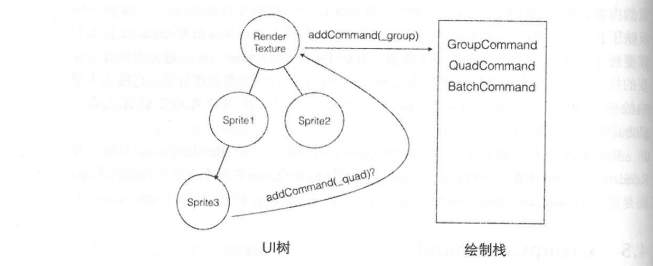
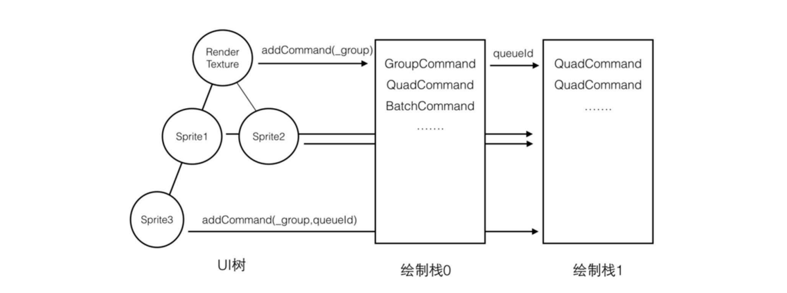
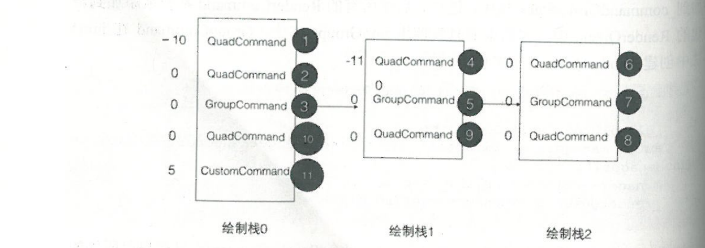

# 全新的绘制系统

> 在v2.x，Cocos2d-x每个元素的绘制逻辑均分布于每个元素内部的draw()方法里，并且紧密地依赖UI树的遍历。<br />
> 虽然通过SpriteBatchNode等机制可以使它目前仍然能高效地工作，但这却是一个不易扩展和优化的架构。<br />
> 例如，依赖UI树的遍历顺序导致无法在多个层级之间调整绘制顺序，各个绘制逻辑分布在每个元素内部不利于对绘制进行优化(如自动批绘制)，针对一些硬件平台的优化可能要修改多个元素的绘制逻辑等。

- v3.x绘制系统的特点

1、将绘制逻辑从主循环中分离。

> 游戏引擎的很大一部分工作是管理场景中的各种UI元素，如它们的坐标变换、UI树结构等。<br />
> 另一部分工作是分别绘制它们。

2、采用应用程序级别的视口裁剪

> 如果一个UI元素在场景中的坐标位于视窗区域之外，那么它根本不会将任何绘制命令发送到绘制栈上。<br />
> 这将减少绘制栈上绘制命令的数量，也将减少绘制命令的排序时间，还会减少对GPU的浪费(OpenGL ES 会在图元装配阶段将位于视口之外的图元丢弃或剪裁)

3、采用自动批绘制技术

> 减少OpenGL ES 的绘制次数(Draw Calls)能增强绘制性能。<br />
> 如果在一个场景中有很多元素都使用同一张纹理、同一个着色器程序等，理论上可以调用一次绘制命令。<br />
> 自动批绘制需要相关的绘制命令在执行顺序上相邻。

4、更简单地实现绘制的自定义

> 自定义绘制可以加入Cocos2d-x的绘制命令栈，参与所有命令的绘制排序。

- 绘制系统

绘制流程分三个阶段:生成绘制命令、对绘制命令进行排序、执行绘制命令

1、通过UI树的遍历给每个元素生成一个绘制命令

> 新的绘制系统实现的基础是将与绘制相关的部分从UI元素中分离。<br />
> RenderCommand 表示一个绘制类型，它定义了怎样绘制一个UI元素。<br />
> 一般情况下，每个UI元素会关联0个或1个RenderCommand，并在重写的Node::draw()方法中将绘制命令发送给render。<br />
> 示例: 如果一个特殊的UI元素需要执行一系列的绘制命令，可以使用特殊的GroupCommand来实现。<br />
> 例如，要实现将所有子元素绘制到纹理而不是屏幕上。

```c++
    void Sprite::draw(Renderer* renderer, const Mat4 &transform, bool transformUpdated)
    {
        // Don't do calculate the culling if the transform was not updated
        _insideBounds = transformUpdated ? renderer->checkVisibility(transform, _contentSize) : _insideBounds;

        if(_insideBounds)
        {
            _quadCommand.init(_globalZOrder, _texture->getName(), getGLProgramState(), _blendFunc, &_quad, 1, transform);
            renderer->addCommand(&_quadCommand);
        }
    }
```

Sprite的draw()方法演示绘制分离的方式。<br />
Sprite 在draw()方法中仅向renderer发送一个RenderCommand(QuadCommand)绘制命令。<br />
此时，它不会执行任何GL绘制命令，renderer会将RenderCommand放入一个栈中，等场景中的UI元素全部遍历完毕，renderer才开始执行栈中的所有RenderCommand。<br />

> 这样就将每个元素的绘制部分从UI树的遍历过程中抽取出来。<br />
> 统一处理所有绘制命令: <br />
> 1-使渲染系统可以针对绘制做一些优化，如针对相邻且使用相同纹理的AuadCommand执行自动批绘制。<br/>
> 2-可以灵活地调整不同UI层级之间的元素的绘制顺序。

2、绘制流程的第二个阶段是对绘制命令进行排序

> 待场景中的UI元素被全部遍历完成，renderer 开始执行栈上的命令。<br />
> 在执行之前，它会对栈上的绘制命令进行排序(中序遍历)，然后按新的顺序执行它们。<br />
> 所以，绘制命令被执行的顺序不一定是UI元素被遍历的顺序。<br />
> v3.x使用一个新的globalZOrder直接设置元素的绘制顺序。<br />
> 元素的绘制顺序首先由globalZOrder决定，然后才是按照元素的遍历顺序，这样就可以在不同层级的元素之间调整绘制顺序。

3、renderer 对经过排序的绘制命令执行绘制

> 对于一般的RenderCommand，按顺序执行。<br />
> 对于Sprite使用的QuadCommand，如果两个QuadCommand相邻且使用相同的纹理、着色器等，renderer会将它们组合成一个QuadCommand，这称为自动批绘制(Auto Batch)。 <br />
> 自动批绘制减少了绘制次数，提升了绘制性能。<br />
> 将绘制统一执行的好处就是系统能够根据一些条件对绘制做一些优化工作。

- RenderCommand

Cocos2d-x渲染系统管理下的每一次绘制调用都是一个RenderCommand，一个RenderCommand 是一种特定的绘制方式的封装。(QuadCommand、GroupCommand继承自RenderCommand)

> 例如，QuadCommand 根据 1 个纹理和 4 个顶点(Quad)绘制一幅图片，或一组OpenGL ES 绘制命令的封装。<br />
> 每个RenderCommand 所包含的OpenGL ES 命令会被放到一起按顺序执行。<br />
> 为了不影响其他RenderCommand的绘制，每个RenderCommand在结束后将对OpenGL ES 的一些状态进行还原，如自定义的摄像机修改了观察点的位置和方向等。<br />

一个UI元素可能使用1个或多个RenderCommand来绘制场景。

```c++
    // RenderCommand 定义
    class RenderCommand
    {
    public:
        enum class Type
        {
            UNKNOWN_COMMAND,
            QUAD_COMMAND,
            CUSTOM_COMMAND,
            BATCH_COMMAND,
            GROUP_COMMAND,
        };

        /** Get Render Command Id */
        inline float getGlobalOrder() const { return _globalOrder; }

        /** Returns the Command type */
        inline Type getType() const { return _type; }
    };

```

1、每个 RenderCommand 实例中包含一个 globalOrder 属性，它是用来决定绘制顺序的重要属性。<br />
为了正确反映场景中元素的层次，所有RenderCommand顺序的计算需要被小心地处理。

2、RenderCommand 的另一个属性是类型(Type)

Cocos2d-x 引擎内置多个RenderCommand类型:

QUAD_COMMAND: 用来绘制1个或多个矩形区域(如Sprite和ParticleSystem)。相邻的QuadCommand如果使用相同的纹理，则可以实现自动批绘制。<br />

BATCH_COMMAND: 用来绘制一个TextureAtlas，如Label、TileMap

> v2.x中TextureAtles 对绘制来自同一纹理的多个精灵的一个封装。<br />
> BatchCommand可能和它相邻的QuadCommand使用同一个纹理，但它不能参与自动批绘制

GROUP_COMMAND:用来包装多个RenderCommand集合，GroupCommand中的每一个RenderCommand都不会参与全局排序。

> GROUP_COMMAND可以用来实现子元素裁剪、绘制子元素到纹理等。<br />
> 它们分别对应于Cocos2d-x中的 ClippingNode 和 RenderTexture 元素

- RenderQueue(绘制命令栈)

场景中每个UI元素的绘制命令RenderCommand将被发送到一个叫作RenderQueue的绘制命令栈上。<br />
RenderCommand中存储者一组RenderCommand。

```c++
    class RenderQueue
    {
    public:
        void push_back(RenderCommand* command);
        ssize_t size() const;
        void sort();
        RenderCommand* operator[](ssize_t index) const;
        void clear();

    protected:
        std::vector<RenderCommand*> _queueNegZ;
        std::vector<RenderCommand*> _queue0;
        std::vector<RenderCommand*> _queuePosZ;
    };
```

RenderQueue::sort() 方法会在开始绘制一个绘制栈之前对RenderCommand进行排序。<br />
出于性能的平衡，RenderQueue中包含3个RenderCommand的数组，分别用来存储globalOrder小于0、等于0及大于0时的RenderCommand。<br />
每个RenderCommand 的 globalOrder 几乎都来自Node的globalZOrder属性，也就是说，一个元素被绘制的顺序首先取决于它自身的globalZOrder属性。<br />
Node的globalZOrder 属性默认值为0，所以，默认情况下每个Node对应的RenderCommand在命令栈上的执行顺序取决于它被添加的顺序。<br />
UI树种的每个元素会按 localZOrder 的顺序被遍历，由于localZOrder反映了开发者定义的元素深度，所有globalZOrder 的值为0的RenderCommand根本不需要再进行排序。<br />
区分global的值为0的RenderCommand，可以避免大部分不必要的排序计算(因为这个排序计算是在每一帧开始绘制时都会进行的，它将大大影响绘制性能) <br />

所以，在应用程序中应该少用或避免设置元素的globalZOrder 属性。

> Render 实际上维护着一个 RenderQueue 的数组。 <br />
> 每个 RenderQueue 对应一组 RenderCommand 或 一个 GroupCommand <br />
> 这些 RenderQueue 之间不是简单的线性关系，而是通过 GroupCommand 构成的树状关系

- GroupCommand

GroupCommand 通常不包含具体的GL绘制命令，它只指向一个 RenderQueue。 <br />
当渲染系统绘制一个 GroupCommand 时，它将找到对应的 RenderQueue,然后执行其中的 RenderCommand。

```c++
    // GroupCommand 的定义
    class GroupCommand : public RenderCommand
    {
    public:
        GroupCommand();
        ~GroupCommand();

        void init(float depth);
        inline int getRenderQueueID() const {return _renderQueueID; }

    protected:
        int _renderQueueID;
    };

```

如果把一组 RenderCommand 加入 GroupCommand 指向的 RenderQueue 中，则可以实现对这组 RenderCommand 的独立绘制，<br />
它们的执行顺序不会受其他 RenderCommand 的影响(例如，将某些 RenderCommand 设置为在某些特定的 GL 参数下绘制)



GroupCommand 在添加到 Renderer 的绘制栈上时，会使用不同于其他 RenderCommand 的策略。<br />
RenderTexture 将所有子元素绘制到纹理上，子元素甚至根本不知道它父级的某个元素是一个 RenderTexture，也不应该知道。<br />
所以，GroupCommand 在实现机制上应该使其所包含的 RenderCommand 像在正常情况下一样被使用。

Cocos2d-x 采用的方式是将分组中的 RenderCommand 放到单独的 RenderQueue 上，然后 GroupCommand 会记录这个 RenderQueue。<br />
Render 持有多个 RenderQueue，用 _renderGroups 来存储。<br />
默认情况下，所有的RenderCommand 被添加到索引为 0 的 RenderQueue 中，称其为 主绘制栈。

```c++
    // Render 类的定义
    class Render
    {
    public:
        void addCommand(RenderCommand* command);
        void addCommand(RenderCommand* command, int renderQueue);
        void pushGroup(int renderQueueID);
        void popGroup();

        int createRenderQueue();

    protected:
        /**
            _commandGroupStack 中保存了一个 RenderQueue 的栈。
            每当开始一个 GroupCommand,都会将对应的一个新建的RenderQueue 的ID 压人栈。
            默认，addCommand 会将 RenderCommand 添加到 _commandGroupStack 栈的最后一个元素所对应的 RenderCommand 中，
            这样就能将所有子元素的 RenderCommand 保存到一个单独的 RenderQueue 上了。

            当分组结束时，GroupCommand 从 _commandGroupStack 上移除自己，
            后续的 RenderCommand 将继续加入之前的 RenderQueue 中且不受影响。
            这样每个 RenderCommand 不需要关系自己是否处于一个 GroupCommand,而且在一个GroupCommand 中可以包含嵌套的 GroupCommand
        */
        std::stack<int> _commandGroupStack;
        std::vector<RenderQueue> _renderGroups;

    // 省略了 Render 的其他成员和方法
    };
```



> 在添加 GroupCommand 时，有一个约定的操作: <br />
创建一个 GroupCommand 并将其作为一个普通的 RenderCommand 发送到当前的 RenderQueue 上，<br />
> GroupCommand 会在 Render 上创建一个新的 RenderQueue,并调用 pushGroup() 方法将其 renderQueueId 添加到 _commandGroupStack 栈中，<br />
> 这样，后续所有的 RenderCommand 都会被添加到新创建的 RenderQueue 中，在结束时调用 popGroup() 方法。 <br />
> GroupCommand 在 init() 方法中创建 RenderQueue 

```c++
    /**
        实现了一个递归的 GroupCommand，每个 RenderCommand 只在自己所处的那一级 GroupCommand 中参与排序
    */
    void GroupCommand::init(float globalOrder)
    {
        _globalOrder = globalOrder;
        auto manager = Director::getInstance()->getRenderer()->getGroupCommandManager();
        manager->releaseGroupID(_renderQueueID);
        _renderQueueID = manager->getGroupID();
    }
```

- Render

> 在主线程遍历完 UI 树，并将每个 UI 元素的绘制发送到绘制栈上之后，绘制栈线程开始执行全部绘制命令。<br />
> 此时，Render 需要先对 RenderCommand 进行排序，然后按新的顺序分别执行绘制命令。

1、RenderCommand

```c++
    // Renderer 首先对每个 RenderQueue 进行排序
    /**
        RenderQueue 有三个数组，在 RenderCommand 插入时会根据 globalZOrder
        大于0、等于0、小于0而存放在不同的数组
    */
    bool compareRenderCommand(RenderCommand* a, RenderCommand* b)
    {
        return a->getGlobalOrder() < b->getGlobalOrder();
    }
```

RenderQueue 对所有 globalOrder 的值为 0 的 RenderCommand 都不执行排序,<br />
而是以它们被添加到 RenderQueue 顺序为准，即由 Node 的 localZOrder 为准进行绘制。



Render 对所有的 RenderCommand 的执行顺序:

> 可以看作一个由 GroupCommand 定义的树，每个分支由一个 GroupCommand 定义， <br />
> 而绘制顺序则是一个深度优先的遍历算法。<br />
> 注意: RenderCommand 的 globalOrder 只在自己所处的 RenderQueue 内部进行排序，所以，它不能与其他 RenderQueue 上的 globalOrder 进行比较

2、QuadCommand

QuadCommand 用于绘制一个或多个矩形区域，每个矩形是一个纹理的一部分，如 Sprite、Tiles、ParticleSystemQuad 等。

> 一个 QuadCommand 包含 4 部分内容: <br />
> TextureID: OpenGL ES 绘制使用的纹理。 <br />
> Shader Program:  <br />
> BlendFunc: 指定混合模式  <br />
> Quads： 需要绘制的1个或多个矩形区域的定义，包括每个点的坐标、颜色和纹理坐标。

模型视图变换矩阵用于在顶点着色器中进行顶点坐标转换

```c++
    // QuadCommand 定义
    class QuadCommand : public RenderCommand
    {
    public:
        static const int MATERIAL_ID_DO_NOT_BATCH = 0;

        QuadCommand();
        ~QuadCommand();

        void init(float globalOrder, GLuint texutreID, GLProgramState* shader, BlendFunc blendType, V3F_C4B_T2F_Quad* quads, sszie_t quadCount, const Mat4& mv);

        void useMaterial() const;

        inline uint32_t getMaterialID() const { return _materialID; }
        inline GLuint getTextureID() const { return _textureID; }
        inline V3F_C4B_T2F_Quad* getQuads() const { return _quads; }
        inline ssize_t getQuadCount() const { return _quadsCount; }
        inline GLProgramState* getGLProgramState() const { return _glProgramState; }
        inline BlendFunc getBlendType() const { return _blendType; }
        inline const Mat4& getModelView() const { return _mv; }

    protected:
        void generateMaterialID();

        uint32_t _materialID;
        GLuint _textureID;
        GLProgramState* _glProgramState;
        BlendFunc _blendType;
        V3F_C4B_T2F_Quad* _quads;
        ssize_t _quadsCount;
        Mat4 _mv;
    };
```

一个Quad有4个顶点，每个顶点的定义见结构体 V3F_C4B_T2F，它对应于OpenGL ES 绘制时的一个顶点

```c++
    //! a point wiht a vertex point, a tex coord point and a color 4B 
    struct V3F_C4B_T2F
    {
        // ! vertices (3F)
        Vec3 vertices;          // 12 bytes

        // ! colors (4B)
        Color4B colors;         // 4 bytes

        // tex coords (2F)
        Tex2F texCoords;        // 8 bytes
    }

```

自动批绘制(Automatic Batching) 技术: <br />

> 对多个相邻的 QuadCommand，如果它们使用相同的纹理、着色器等绘制特征，则只会调用一次 OpenGL ES 绘制命令。<br />
> 这使应用程序可以不依赖手动将 Sprite 添加到 SpriteBatchNode 的方式就能实现批绘制。 <br />
> 尤其是对多个不同类型的UI元素，但是最终都使用 QuadCommand 进行绘制的情况，能极大提高绘制性能。


使用 Render::render() 方法的自动批绘制过程:

> 第一次遇到一个 QuadCommand 时不会立即绘制，而是将其放到一个数组中缓存起来，然后继续迭代后面的 RenderCommand <br />
> 如果遇到的第二个 RenderCommand 的类型仍然是 QUAD_COMMAND,并且它们使用同样的 "材料"，则继续将该 QuadCommand 添加到缓存数组中。 <br />
> 如果它们使用不同的 "材料"，或者类型不是 QUAD_COMMAND,则首先绘制之前缓存的 QuadCommand数组。<br />
> 相邻且使用相同 "材料" 的 QuadCommand 会被自动组合到一起，形成一次绘制

这里的 "材料" 不仅指纹理和着色器，还包括使用的混合模式及其他一些OpenGL ES 的状态设置。<br />
QuadCommand 生成 materialID 的方法。

```c++
    void QuadCommand::generateMaterialID()
    {
        if(_glProgramState->getUniformCount() > 0)
        {
            /**
                先检查其是否包含自定义的着色器全局变量(Uniform)。
                如果有自定义的着色器变量，那么要想使用这些变量，开发者必须提供自定义的着色器，也就是它不能和系统的 QuadCommand 形成批绘制。
                如果开发者提供自定义的着色器，_materialID 被设置为 MATERIAL_ID_DO_NOT_BATCH,表示该 QuadCommand 不能参与任何批绘制，
                即使两个 QuadCommand 使用同一个自定义着色器及相关状态。
            */
            _materialID = QuadCommand::MATERIAL_ID_NOT_BATCH;
        }
        else
        {
            /**
                如果不包含自定义的全局变量，
                则使用与着色器名称、纹理名称及混合方程相关的参数计算一个Hash值，
                只有具有相同的Hash值的QuadCommand 才能参与批绘制。
            */
            int glProgram = (int)_glProgramState->getGLProgram()->getProgram();
            int intArray[4] = { glProgram, (int)_textureID, (int)_blendType,src, (int)_blendType.dst };

            _materialID = XXH32((const void*)intArray, sizeof(intArray), 0)
        }
    }

    /**
        在场景中只要使用同一张纹理，以及相同的 Shader 程序和混合模式，
        在绘制顺序上相邻的所有Sprite就可以自动实现批绘制，从而有效提升绘制性能。

        在 Cocos2d-x 中，所有顶点数据使用一个 VBO(Vertex Buffer Object) 对象，
        它能够容纳的最大Quad 的数量是 10922(65536/6)。
        当 Quads 的数量大于这个值时，将立即绘制前面的命令。
    */
```

- 元素的可见性

自动裁剪(Auto Culling) 技术: <br />
它在遍历UI树时进行位置计算，如果发现其位于屏幕之外，则不会发送绘制命令到 Render 中，目前它仅在 Sprite 元素上使用

```c++
    void Sprite::draw(Render* render, const Matrix &transform, bool transformUpdated)
    {
        /**
            Sprite 在绘制是首先会会计算其可见性，如果 _insideBounds 的结果为 false，
            则表示该元素在场景中不可见，不需要绘制。
            checkVisibility 是 Renderer 提供的一个辅助方法。
        */
        _insideBounds = transformUpdated ? renderer->checkVisibility(transform, _contentSize) : _insideBounds;

        if(_insideBounds)
        {
            _quadCommand.init(_globalZOrder, _texture->getName(), getGLProgramState(), _blendFunc, &_quad, 1, transform);
            renderer->addCommand(&_quadCommand);
        }
    }
```

可见性行计算会发生在每一帧的每一个Sprite元素中,所以，_insideBounds 仅在该元素发生位置变动时才会重新计算，这包括对元素执行扭曲、缩放、平移、旋转及父级元素发生这些项的修改情况。

> 但是，如果场景中的很多Sprite 元素都处于变化状态，则意味着这些元素的每一帧都要重新执行可见性计算，这会对性能有一定的影响。<br />
> checkVisibility() 方法在引擎内部只作用于 Sprite 上，其原因是一个 Sprite 对应于图元或者一次绘制。对于其他包含很多子元素的元素，如Label和ParticleSystem，则需要单独对每个子元素进行更小粒度的可见性计算，但其效率也许会下降。 <br />

> 即便如此，如果一个应用程序中有很大的场景，则不应该完全依赖自动裁剪。<br />
> 因为自动裁剪只是减少了绘制命令调用的次数，而这些元素所使用的纹理仍然占据着内存， <br />
> 所以对于大场景，还需要注意对纹理内存的管理，对不可见的元素可以手动移出场景并删除其使用的纹理。 

关于可见性，Node类还有一个属性--visible。 <br />
visible属性用于控制一个元素要不要显示，只有 visible 属性的值为 true 时才会进行可见性的判断。 <br />
当一个元素的 visible 属性的值为 false 时，该元素在遍历UI树时被忽略。

```c++
    void Node::visit(Renderer* renderer, const Matrix &parentTransform, bool parentTransformUpdated)
    {
        // quick return if not visible. children won't be drawn
        /**
            因此，该元素及其所有子元素都不会被绘制。
            _insideBounds 只会影响 Sprite 的 draw() 方法，它只能控制自己的可见性，不会阻止子元素的遍历。
        */
        if (!_visible)
        {
            return;
        }
    }
```

> 一个事件的订阅者可以指定一个与之相关联的 Node，事件分发器会按照 Node 的层级顺序进行分发，visible() 方法或 insideBounds() 方法不会影响事件的分发。<br />
> 因此，对触摸事件，会造成一种非预期的结果: 一个元素虽然不可见，但是它能够接收触摸事件。

元素的可见性与事件没有完全的对等关系，像触摸这种与可见性具有一定对等关系的情况需要特殊判断。

```c++
    // Menu 类提供的例子

    /**
        Menu 类在处理触摸事件的逻辑中，首先会对自身及父级元素的可见性进行判断。
        如果自己所在的分支上的任意一个元素不可见，则不响应触摸事件。
    */
    bool Menu::onTouchBegan(Touch* touch, Event* event)
    {
        if (_state != Menu::State::WAITING || !_visible || !_enabled)
        {
            return false;
        }

        if (Node *c = this->_parent; c != nullptr; c = c->getParent())
        {
            if (c->isVisible() == false)
            {
                return false;
            }
        }
    }
```

在应用程序中，如果有类似与可见性对等的事件或者其他逻辑，可以参照上面的思路处理。

- 绘制的时机

> 因为UI树遍历时只是发送绘制命令到 Renderer,然后立即返回，并不知道什么时候绘制命令被执行。 <br />
> 这种机制对一些操作(如 RenderTexture 需要等到绘制完毕后操作纹理，则会显得不方便)

两种方法处理:

1、注册一个 Schedule。

> 这个 Schedule 在下一帧被执行时读取绘制结果，并注销该 Schedule。 <br />
> 因为该 Schedule 只使用一次，所以它专门用于读取上一帧的绘制结果。

2、添加一个 CustomCommand 来提供一个通知

> 能精确把握绘制的时机。<br />
> CustomCommand 是一个自定义的绘制类型，它在被 Renderer 执行时会调用应用程序指定的一个 func() 方法进行自定义绘制，<br />
> func 中通常包含了一系列 GL 命令的调用。<br />
> 但是，由于 func 是在 Renderer 执行绘制命令时发出的，所以，只有将其放置得合适在绘制位置， <br />
> 我们就可以将 func 作为一个绘制时机的回调函数。

示例可以参考 RenderTexture 保存图片的方法。

```c++
    /**
        RenderTexture 提供 saveToFile() 方法，
        该方法向 Renderer 注册一个名为 _saveToFileCommand 的自定义绘制命令
    */
    bool RenderTexture::saveToFile(const std::string& fileName, Image::Format format)
    {
        CCASSERT(format == Image::Format::JPG || format::Format::PNG, "the image can only be saved as JPG or PNG format");
        std::string fullpath = FileUtils::getInstance()->getWritablePath() + fileName;
        _saveToFileCommand.init(_globalZOrder);
        _saveToFileCommand.func = CC_CALLBACK_0(RenderTexture::onSaveToFile, this, fullpath);

        Director::getInstance()->getRenderer()->addCommand(&_saveToFileCommand);
        return true;
    }

    // _saveToFileCommand 的回调仅用于将纹理保存到磁盘中，并没有包含任何 GL 的操作
    void RenderTexture::onSaveToFile(const std::string& filename)
    {
        Image* image = newImage(true);
        if(image)
        {
            image->saveToFile(filename.c_str(),true);
        }
        CC_SAFE_DELETE(image);
    }
    /**
        如果将 _saveToFileCommand 命令置于 RenderTexture 的绘制命令之后，
        就可以在 RenderTexture 被绘制后立即得到通知
    */
```


END