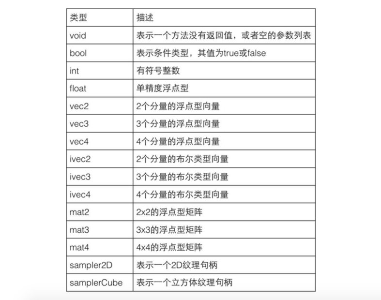
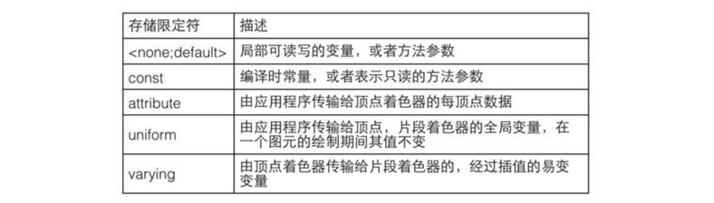
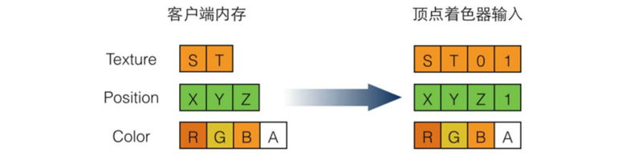

# OpenGL ES 着色语言

OpenGL ES 渲染管线包含一个可编程的顶点着色阶段和一个可编程的片段着色器阶段，其他的阶段则只能通过一些固定的方法做有限的控制。<br />
每个可编程阶段使用一个着色器作为一个处理单元，分别对顶点和片段进行自定义的处理。<br />
顶点着色器和片段着色器被编译和链接在一起，形成一个着色器程序(Shader Program)。<br />
这个着色器程序被上传至 GPU，被OpenGL ES 作用在渲染管线上。

> OpenGL ES 集成了一种类似于C语言的着色语言，它可以用在编写应用于OpenGL ES 渲染管线上的处理命指令，这些处理指令根据其作用的目标不同分为顶点着色器和片段着色器。<br />

顶点着色器是一个可编程的处理单元，它的操作目标是渲染管线输入的顶点及相关的数据。<br />

> 顶点着色器针对每个顶点作用一次，以计算每个顶点的剪裁坐标。<br />
> 它还可以计算顶点的深度缓冲(z-buffer)、颜色及纹理坐标等，但是无法生成新的顶点。

片段着色器的操作目标则是渲染管线输入的每一个片段、顶点着色器输出的数据，以及其他相关的数据。

> 片段着色器对每个片段作用1次，它用来计算片段的颜色值。<br />
> 片段着色器不能改变片段的位置。<br />
> 片段着色器输出的颜色值用来更新帧缓冲内存中该位置的颜色值，这些颜色值最终被绘制到屏幕或一张纹理上(如果帧缓冲被绑定到一张纹理上)。

### 基础类型

> OpenGL ES 语言相较C语言有更多的限制。<br />
> 不支持字符串操作、不支持精度更高的 double 类型、不支持指针。对数组操作也有一定限制。<br />
> 强类型语言，每个变量和方法在使用之前必须定义它，每个变量必须有特定的类型。<br />
> 不支持任何隐式转换。



- 矢量

OpenGL ES 中的矢量用来表示一个具有2个、3个、4个分量(Component)的数据类型，每个分量的类型可以是 float、int、bool。<br />
浮点型的矢量用来表示图形学中的一些数据，如颜色、法线、位置、纹理坐标等。

> 在OpenGL ES 中使用矢量，能够充分利用图形硬件的性能处理矢量计算。<br />
> 由硬件实现的矢量计算能够实现并行计算，从而提升应用程序的性能。

```c
    vec2 texcoord1, texcoord2;
    ivec2 textureLookup;
```

- 矩阵

OpenGL ES 着色语言支持2X2、3X3、4X4的矩阵，矩阵的成员只能是浮点型。<br />
矩阵的读和写按列优先的顺序排序。

```c++
    mat2 mat2D;
    mat3 optMatrix;
    mat4 view, projection;
```

- 采样器

采样器类型(sampler2D)用于简化OpenGL ES 程序中的纹理处理过程，它通常和OpenGL ES 内置的纹理查找方法(TextureLookup)一起工作，用于指定一张纹理。<br />
采样器仅可以被定义为方法参数或者使用uniform限定符修饰。

> 采样器不能使用在表达式中、不能作为左值、不能使用out或inout的方法参数。<br />
> 被uniform 修饰的采样器变量自动被 OpenGL ES 初始化，作为方法参数，采样器形参变量只能被同样的采样器变量赋值。

- 结构体

> 成员类型必须是已经被定义的类型、不允许嵌套定义

- 数组

> 数组的尺寸必须被声明为一个大于0的常量表达式，当数组作为方法参数时，必须声明数组的尺寸。只包含意味数组。

```c
    float frequencies[3];
```

在着色器程序中，不能在定义时初始化数组成员。数组的成员只能在定义之后逐一赋值

### 存储限定符

> 变量的声明可以使用一个存储限定符来修饰。限定符置于类型前面



> 本地变量和方法参数只能使用const限定符，方法返回值和结构体成员不能使用限定符<br />
> 数据不能从一个着色器程序传递给下一个阶段的着色器程序，这样会阻止同一个着色器程序在多个顶点或片段进行并行计算。<br />
> 
> 不包含任何限定符或包含const限定符的全局变量可以包含初始化器，这种情况下这些变量会在main()函数开始之后第一行代码之前被初始化，这些初始化值必须是常量表达式。<br />
> 没有任何限定符的全局变量，如果没有在定义时初始化或者在程序中被初始化，则其值在进入main()函数后是未定义的。<br />
> uniform、attribute、varying限定符修饰的变量不能在初始化被赋值，这些变量的值由OpenGL ES 计算提供。

- 默认限定符

> 没有指定限定符，不管是全局变量还是本地变量，它们总是在自己的处理单元被分配内存。

- 常量限定符(const)

> 常量在自己的处理单元内为只读状态。<br />
> const 限定符可以用于任何基本数据类型。<br />
> 常量必须在定义时被初始化，在外部对其赋值则会导致错误。

```c
    const vec3 zAxis = vec3(0.0,0.0,1.0);
```

> 结构体成员不能被声明为常量，但是结构体变量可以被声明为常量。<br />
> 常量必须被初始化为一个常量表达式。<br />
> 数组或包含数组的结构体不能被声明为常量(因为数组不能在定义时被初始化)

- 属性限定符(attribute)

> attribute 限定的变量的值可以由应用程序提供，通过OpenGL ES 传递给顶点着色器程序。<br />
> 属性限定符只能被用在顶点着色器中，在其他的着色器中使用会导致编译错误。

使用属性限定符修饰的变量在顶点着色器程序中是只读的，它的值来自应用程序通过 OpenGL ES API 或顶点数组的一部分传递给顶点着色器。<br />
其类型只能是 float、vec2、vec3、vec4、mat2、mat3、mat4,不能被定义为数组或结构体

> 每个属性变量被存储为一个由4个分量组成的存储空间，每个变量根据其类型占据其中的1~4个存储控件。<br />
> float占1分量 。。。 TODO.<br />
> 当一个属性值传递给顶点着色器程序时，任何没有填充值的分量将被OpenGL ES 设为默认值: <br />
> 每个存储空间的最后一个分量被填充为1，其他分量则填充为0




END