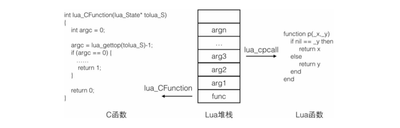

# Lua 相关

#### Lua 的 数据类型
1、数值(number): 内部以double表示。 <br />
2、字符串(string): <br />
3、布尔(boolean): 只有 true 和 false <br />
4、函数(function): <br />
5、表(table): 异构的Hash 表 <br />
6、userdata: 定义的C数据结构，脚本只能使用它，不能定义。<br />
7、线程(thread):Lua协程(coroutine) <br />

#### metatable(元表)
Lua中 metatable 是一个普通的 table,功能如下: <br />
1、定义算术操作符和关系操作符的行为。 <br />

> 例如: Lua 尝试对两个table进行加操作时，它会按顺序检查两个table是否有一个存在 metatable 并且这个 metatable 是否存在 __add 域，如果Lua检查到了这个 __add域，这个域被叫做 metamethod(元方法)。<br />
> 
> 每个table和 userdata value 都有一个属于自己的 metatable，其他每种类型的所有value共享一个属于本类型的metatable。<br />
> Lua 中，通过 调用 setmetatable 来设置只能设置 table 的 metatble, <br />
> 在 C/C++ 中调用 Lua API 则可以设置所有 value 的 metatable 。 <br />
> 默认下，string 类型有自己的 metatable，而其他类型则没有。<br />

```lua
-- 初始化一个table, 作为metatable，并定义它的 __add(+) 元方法
local mt = {}
function mt.__add(a,b)
    return 'table +' .. b
end
-- 定于一个table
local t = {}
-- 将 mt 设置为 t 的 元表
setmetatable(t,mt)
print(t + 1)
-- 获取t的元表
getmetatable(t)
```

2、为Lua函数库提供支持。 <br />

> 如果希望设置的value的metatable不被修改，则可以在metatable中设置__metatable域,<br />
> getmetatable将返回此域，而setmetatable则会产生一个错误。

```lua
mt.__metatable = "not your business"
local t = {}
setmetatable(t,mt)
print(getmetatable(t)) -- not your business
setmetatable(t, {}) -- stdin1:cannot change protected metatable
```

3、控制对 table 的访问。

> __index metamethod <br />
> 访问table 的不存在的域(方法\属性)时，Lua会尝试调用 __index metamethod。<br />
> __index metamethod 接收两个参数 table 和 key。<br />
> 可以通过 rawget(t, i) 来访问 table t 的域 i， 而不会访问 __index metatable

```lua
local mt = {}
mt.__index = function(table,key)
    print("table--"..tostring(table))
end

-- __index 域也可以是一个table,Lua会尝试在 __index table 中访问对应的域
-- 可以通过 __index 实现单继承
local mt = {}
mt.__index = {
    a = "Hello World"
}

local t = {}
setmetatable(t, mt)
print(t.a) -- Hello World
```

> __newindex metamethod <br />
> 如果对table的一个不存在的域赋值，Lua将检查 __newindex metamethod <br />
> 1、如果 __newindex 为函数，Lua将调用函数而不是进行赋值。 可以接受三个参数 table key value。<br />
> 2、如果 __newindex 为一个table，Lua将对此 table 进行赋值。 <br />
> 3、使用 rawset(t,k,v) 则不会调用 __new index metamethod

```lua
function readOnly(t)
    local proxy = {}
    local mt = {
        __index = t,
        __newindex = function(t,k,v)
            error("attempt to update a real-only table", 2)
        end
    }

    setmetatable(proxy,mt)
    return proxy
end
```

####  c 绑定 lua
函数: <br />
- 压入元素:

```c++
void lua_pushnil(lua_State *L);                                   //插入空值
void lua_pushboolean(lua_State *L, int bool);                     //插入布尔值
void lua_pushnumber(lua_State *L, double n);                      //插入double
void lua_pushlstring(lua_State *L, const char* s, size_t length); //插入任意字符串
void lua_pushstring(lua_State *L, const char* s);            //插入带'\0'的字符串
```

- 其他操作

```c++
int lua_gettop(lua_State *L);               //返回堆栈中的元素个数
void lua_settop(lua_State *L, int index);   //设置栈顶为一个指定的值，多余值被抛弃，否则压入nil值
void lua_pop(lua_State *L, int n);          //lua_settop(L, -n - 1),从堆栈中弹出n个元素
void lua_pushvalue(lua_State *L, int index);//压入堆栈上指定一个索引的拷贝到栈顶
void lua_remove(lua_State *L, int index);   //移除指定索引位置的元素
void lua_insert(lua_State *L, int index);   //移动栈顶元素到指定索引的位置
void lua_replace(lua_State *L, int index);  //从栈顶中弹出元素并将其设置到指定索引位置
```

- 表操作

```c++
void lua_gettable(lua_State *L, int idx);                    //以栈顶元素为key值，获取指定索引的表的值到栈顶
void lua_getfield(lua_State *L, int idx, const char *k);    //获取指定索引的表对应key的值到栈顶
void lua_getglobal(lua_State *L, const char *name);            //等于lua_getfield(L, LUA_GLOBALSINDEX, (name))。获取全局表的变量到栈顶
void lua_settable(lua_State *L, int idx);                    //以栈顶元素为value，栈顶下一元素为key，设置指定索引的表的值
void lua_setfield(lua_State *L, int idx, const char *k);    //弹出栈顶元素，并设置为指定索引的表对应key的值
void lua_setglobal(lua_State *L, const char *name);            //等于lua_setfield(L, LUA_GLOBALSINDEX, (name))。设置全局变量的值
void lua_rawgeti(lua_State *L, int idx, int n);                //获得idx索引的表以n为key的值
void lua_rawget(lua_State *L, int idx);                        //获得idx索引的表以栈顶为key的值
void lua_rawseti(lua_State *L, int idx, int n);                //设置idx索引的表以n为key的值
void lua_rawset(lua_State *L, int idx);                        //设置idx索引的表以栈顶下一个元素为key的值
```

# 脚本



#### Lua 的 C 函数接口

> 宿主程序需要向 Lua 注册一个 C 函数的地址。 <br />
> 当Lua 调用 C 函数时，被调用的函数会得到一个新的栈(Lua为每一次C函数调用都分配一个独立的栈) ，<br />
> 首先要调用的函数被压入堆栈，<br />
> 接着把需要传递给这个函数的参数按正序压入栈 <br />
> 最后调用 lua_call() 方法。(调用需指明参数的个数) <br />
> 当函数调用完毕，所有的参数及函数本身都会出栈，而函数的返回值则被压入栈。(返回多个值正序压栈)
> 它里面包含了所有Lua传递给C函数的参数，而C函数则要将返回的结果也放入堆栈以返换给调用者。 

```c++
    // 获取栈顶元素，argc 为参数的个数
    int argc = lua_gettop(tolua_S) - 1;
```

> 在启动引擎时调用绑定代码向 Lua 虚拟机注册 <br />
> Cocos2d-x 中，Lua 虚拟机由 LuaEngine 管理

```c++
    auto engine = LuaEngine::getInstance();
    ScriptEngineManager::getInstance()->setScriptEngine(engine);

    // register custom function
    lua_State* L = engine->getLuaStack()->getLuaState();
    register_custom(L);

    /**
        程序启动时，LuaEngine 会调用register_custom(L),将register_custom(L)中的对象注册到Lua虚拟机中，这样Lua就能调用自定义对象的方法
    */

```

Node 实例: 

```c++
    int lua_cocos2dx_Node_create(lua_State* tolua_S)
    {
        int argc = 0;
        bool ok true;
        argc = lua_gettop(tolua_S) - 1;
        if(argc == 0){
            if(!ok)
                return 0;

            Node* ret = Node::create();
            // 堆栈、类型、实例
            object_to_luaval<Node>(tolua_s, "cc.Node", (Node*)ret);
            return 1;
        }
        return 0;
    }
```

> 在 Lua 中调用 cc.Node:create() 时将执行lua_cocos2dx_Node_create()。 <br />
> 然后调用原生的 Node::create() 方法创建一个 Node* ret 对象。<br />
> object_to_luaval<Node>() 是为 ref 实例构建一个 userdata 对象来在 Lua 中引用其内存地址，并从注册表中查找该类型 metatable,让该对象拥有其表示类型的 metatable。

Lua 面向对象: <br />

> lua 中没有类的概念，只有table表，而面向对象的实现是将表与父类的表连在一起，没有这个变量时去父类查找。<br / >
> 过程: <br />
> 建一个table cls <br />
> 1、如果有supers,设置父类 <br />
>   a、如果 super 是 function 类型，则将 cls.__create = super <br />
>   b、如果 super 是 table <br />
>       b1、且 父类是原生的cocos类，比如cc.Node，则 cls.__create 为调用 super:create() <br />
>       b2、父类是自定义的类，如 a = {},则 将他放进 cls.__supers <br />
> 
> 2、设置元表，将 父类设置为其元表 <br />
> 3、为 cls 设置一个默认的 构造函数(ctor) <br />
> 4、新建方法(xxx.new()) <br />
>   a、如果存在 __create,则通过 cls.__create 创建实例 <br />
>   b、否则 实例为 {} <br />
>   c、调用构造函数  <br />
>   

```lua
function class(classname, ...)     
    -- 参数一：要创建的类名称，参数二：父类-可选参数，可以是table，function，userdata等
    local cls = {__cname = classname}

    local supers = {...}   
    for _, super in ipairs(supers) do    -- 遍历父类
        local superType = type(super)
        -- 父类如果不是第一个参数表示的类型的话，就输出第二个参数
        if superType == "function" then
            -- 如果父类是个function的话，就让cls的create方法指向他
            cls.__create = super
        elseif superType == "table" then  
            -- 如果父类是table
            if super[".isclass"] then
                -- 如果父类是原生的cocos类，比如cc.Node，不是自己定义的类
                cls.__create = function() return super:create() end
            else
                -- 如果父类是自定义的类，比如 A = {}
                cls.__supers = cls.__supers or {}
                cls.__supers[#cls.__supers + 1] = super       -- 保存cls的多个父类的table表
                if not cls.super then
                    -- 将遍历到的第一个table作为cls的父类
                    cls.super = super
                end
            end
        else
            -- 如果父类既不是table，也不是function的话，报错。如果父类不存在，不会执行这个循环的，所以super可以为nil。
            error(...)
        end
    end
    -- 前面一大段是找到cls的所有父类；
    -- 接下来就是设置cls的元表了。
    -- 设置cls的第一索引对象是自己，如果实例对象找不到某个参数的话，
    --就会查找该类是否包含该参数，如果该类也不包含的话，就去父类查找
    cls.__index = cls   
    if not cls.__supers or #cls.__supers == 1 then  
        -- 如果cls只有一个父类，即单继承的话，设置cls的父类是他的元表
        setmetatable(cls, {__index = cls.super})
    else
        -- 如果cls是多重继承的话，__index为一个函数，找元素的时候就会执行一遍该函数
        setmetatable(cls, {__index = function(_, key)
            -- 遍历所有父类，查找key对应的值并返回
            local supers = cls.__supers
            for i = 1, #supers do
                local super = supers[i]
                if super[key] then return super[key] end
            end
        end})
    end

    if not cls.ctor then
        -- 增加一个默认的构造函数
        cls.ctor = function() end
    end
    cls.new = function(...)  -- 新建方法，这个也是比较重要的方法
        local instance
        if cls.__create then
            -- 如果有create方法，那么就调用，正常情况下，自定义的cls是没有create方法的。
            -- 通过__index和元表的index，一级一级往上找，直到找到原生cocos类
            instance = cls.__create(...)
        else
            instance = {}  -- 没有create方法，他是一个普通类
        end
        -- 设置instance的元表index，谁调用了new，就将他设置为instance的元类index
        setmetatableindex(instance, cls)
        instance.class = cls
        instance:ctor(...) --调用构造方法
        return instance
    end
    cls.create = function(_, ...)
        return cls.new(...)
    end

    return cls
end

```


#### Lua 的深拷贝

```lua
-- 首先，table 中所有的值拷贝一份，存放到一个新的 table 中(目标table)
-- 再将源table的元表取出赋值给目标table 的元表
function clone(object)
    local lookup_table = {}
    local function _copy(object)
        if type(object) ~= "table" then
            return object
        elseif lookup_table[object] then
            return lookup_table[object]
        end
        local newObject = {}
        lookup_table[object] = newObject
        for key, value in pairs(object) do
            newObject[_copy(key)] = _copy(value)
        end
        return setmetatable(newObject, getmetatable(object))
    end
    return _copy(object)
end
```


END