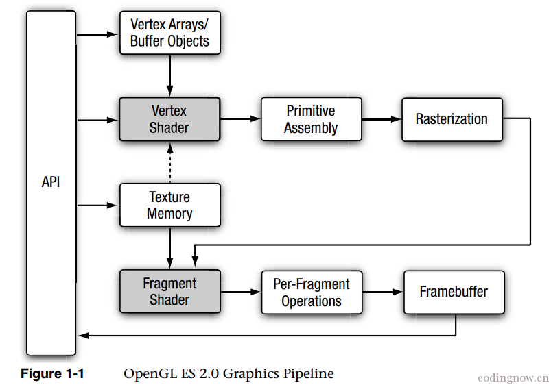

# shader 

### shader 开发流程
1. 编写 vertex Shader 和 fragment Shader 源码 <br />
2. 创建两个 shader 实例：GLuint glCreateShader(GLenum type);[gl.createShader] <br />
3. 给 Shader 实例指定源码：glShaderSource[gl.shaderSource] <br />
4. 编译 shader 源码: void glComplieShader(GLuint shader)[gl.complieShader] <br />
5. 创建 shader program: GLuint glCreateProgram(void)[gl.createProgram] <br />
6. 绑定 shader 到 program: void glAttachShader(GLuint program, GLuint shader)。每个program 必须绑定一个 vertex shader 和一个 fragment shader。[gl.attachShader] <br />
7. 连接 program: void glLinkProgram(GLuint program)[gl.linkProgram]

# OpenGL ES 2.0 渲染流程

OpenGL ES 渲染流程及渲染管线，阴影部分为可编程阶段

```
图片模型-[转化成]->一组图元 
每个图元-[由..组成]->一个或多个顶点
每个顶点:
    定义一个点、一条边的一端或者三角形的一个角,
    关联一些数据，这些数据包括顶点坐标、颜色、法向量及纹理坐标等
```



### 1 VB0/VAO(顶点缓冲区对象/顶点数组对象)
VBO/VAO 是 CPU 提供给 GPU 的顶点信息，包括顶点的位置、颜色、纹理坐标(用于纹理贴图)等顶点需信息。<br />

VBO

> Vertex Buffer Object。<bt />
> 它是GPU里面的一块缓冲区，当我们需要传递数据时，可以先向GPU申请一块内存，然后往里面填充数据。<br />
> 最后，再调用 glVertexAttribPointer 把数据传递给 Vertex Shader(顶点着色器)

VAO

> Vertex Array Object <br />
> 它的作用主要是记录当前有哪些VBO,每个VBO里面绑定的是什么数据，还有每一个 vertex attribute 绑定的是哪一个 VBO

### 2 VertexShader(顶点着色器)

顶点着色器是处理 VBO/VAO 提供的顶点信息的程序。<br />
VBO/VAO 提供的每个顶点都执行一遍顶点着色器。<br />
Uniforms(一种变量类型)在每个顶点保持一致，Attribute每个顶点都不同(可以理解为输入顶点属性) <br />

顶点着色器的输入数据组成:

> - Attributes: 使用顶点数组封装每个顶点的数据，一般用于每个顶点都各不相同的变量，如顶点位置、颜色等。<br />
> - Uniforms:顶点着色器使用的常量数据，不能被着色器修改，一般用于对同一组顶点组成的单个3D物体中所有顶点相同的变量，如当前光源的位置。<br />
> - Samplers: 可选，一种特殊的uniforms，表示顶点着色器使用的纹理 <br/>
> - Shader program: 顶点着色器的源码或可执行文件，描述对顶点执行的操作。

顶点着色器的输出:

> varying: 在图元光栅化阶段，这些 varying 值为每个生成的片段进行计算，并将结果作为片段着色器的输入数据。从分配给每个顶点的原始 varying 值来为每个片段生成一个 varying 值得机制叫做插值。 <br />
> gl_position、gl_FrontFacing、gl_PointSize

顶点着色器可用于传统的基于顶点的操作，例如: 基于矩阵变换位置，进行光照计算来生成每个顶点的颜色，生成或者变换纹理坐标。<br />
另外因为顶点着色器是由应用程序指定的，所以可以用来进行任意自定义的顶点变换。

### 3 PrimitiveAssembly(图元装配)

把顶点着色器输出的顶点组合成图元。<br />

> 图元(primitive) 是一个能用 opengl es 绘图命令绘制的几何体，包括三角形、直线或点精灵等几何对象，<br />
> 绘图命令指定了一组顶点属性，描述了图元的几何形状和图元类型。<br />

在图元装配阶段，这些着色器处理过的顶点被组装到一个个独立的几何图元中，例如三角形、线、点精灵。<br />
对于每个图元，必须确定它是否位于视锥体内(3维空间显示在屏幕上的可见区域)，如果图元部分在视锥体中，需要进行裁剪，在视锥体外，则直接丢弃图元。<br />
剪裁后，顶点位置装换成屏幕坐标。<br />

> 背面剔除操作也会执行，它根据图元在正面还是背面，如果是背面则丢弃该图元。

然后进入下一个阶段: 光栅化

### 4 光栅化

光栅化是将图元转化为一组二维片段的过程，然后这些片段由片段着色器处理(片段着色器的输入)

> 这些二维片段代表着可在屏幕上绘制的像素。<br />

用于从分配给每个图元顶点的顶点着色器输出生成每个片段值的机制称插值(Interpolation)

> 从 CPU 提供的分散的顶点信息是如何变成屏幕上密集的像素的? <br />
> 图元装配后的顶点可以理解为变为图形，光栅化时可根据图形的形状，插值出那个图形区域的像素(纹理坐标 v_texCoord、颜色等信息)。<br />
> 此时的像素并不是屏幕上的像素，是不带颜色的。<br />
> 接下来的片段着色器完成上色的工作

总之，光栅化阶段把图元转换成片段集合，之后提交给片段着色器处理，这些片段集合表示可以被绘制到屏幕的像素。

### 5 FragmentShader(片段着色器)

片段着色器，为片段(像素)上的操作实现了通用的可编程方法，光栅化输出的每个片段，都指定一遍片段着色器，对光栅化阶段生成每个片段，执行这个着色器，生成一个或多个(多重渲染)颜色作为输出。<br />

需要的输入数据:

> - Varying variables: 顶点着色器输出的 varying 变量，经过光栅化插值计算后，产生的作用于每个片段的值。<br />
> - Uniforms: 片段着色器使用的常量数据。<br />
> - Samplers: 一种特殊的 uniforms,表示片段着色器使用的纹理。<br />
> - Shader program: 片段着色器的源码或可执行文件

片段着色器也可以丢弃或为片段生成一个颜色值，保存到内置变量 gl_FragColor。<br />
光栅化阶段产生的颜色、深度、模板和屏幕坐标(Xw,Yw)成为流水线中 pre-fragment 阶段的输入。

### 6 Per-Fragment Operations(逐个片段操作阶段)

包括一系列的测试阶段。<br />
一个光栅化阶段产生的具有屏幕坐标(Xw,Yw)的片段，只能修改 framebuffer(帧缓冲)中位置在(Xw,Yw)的像素。

Pixel Ownership Test: <br/>

> 像素所有权测试决定framebuffer中某一个(Xw, Yw)位置的像素是否属于当前Opengl ES的context，比如：如果一个Opengl ES帧缓冲窗口被其他窗口遮住了，窗口系统将决定被遮住的像素不属于当前Opengl ES的context，因此也就不会被显示。

Scissor test :

> 裁剪测试决定位置为(Xw,Yw)的片段是否位于剪裁矩形内，如果不在，则被丢弃

Stencil and depth test(模板和深度测试):

> 传入片段的模板和深度值，决定是否丢弃片段

Blending:

> 将新产生的片段颜色值和 framebuffer 中某个(Xw,Yw)位置存储的颜色进行混合。

Dithering：

> 抖动可以用来最大限度的减少使用有限精度存储颜色值到 framebuffer 的工件

逐片段操作后，片段要么被丢弃，要么一个片段的颜色、深度或模板值被写入到 framebuffer 的 (Xw,Yw) 位置。<br />
不过是否真的写入还得依赖于 write masks 启用是否。write masks 能更好的控制颜色、深度和模板值得写入到合适的缓冲区。


-----------------------------------------------------

# OpenGL ES 

> 手机包含两个不同的处理单元，CPU和GPU(图形处理单元) <br />
> 着色器(shader)

在OpenGL ES 中可以创建两种着色器:顶点着色器(vertex shaders) 和 片段着色器(fragment shaders)

顶点着色器:

> 定义了在2D或3D场景中几何图形是如何处理的。<br />
> 一个顶点指的是2D或3D空间中的一个点。<br />
> 在图像处理中，有4个顶点:每一顶点代表图像的一个角。<br />
> 顶点着色器计算顶点的位置(为后期像素渲染做准备)，并且把位置和纹理坐标这样的参数发送到片段着色器。

片段着色器:

> GPU 使用片段着色器在对象或图片的每一个像素上进行计算，最终计算出每个像素的最终颜色。<br />
> 以像素为单位，计算光照、颜色的一系列算法

顶点坐标空间从 -1.0 延展到 1.0，纹理坐标从 0.0 到 1.0 <br />

GLSL 有一些内建的变量，这些特殊的变量是可编程管道的一部分，API会去寻找它们，并且知道如何和它关联上。

> gl_Position 是一个内建的变量，gl_xxxx

在 GLSL 中，有三种标签可以赋值给变量，这些变量是 GLSL 的输入和输出，它允许从应用的输入，以及在顶点着色器和片段着色器之间进行交流。

#### 输入输出

> 1) Uniforms <br />
> 由应用程序提供，全局只读 <br />
> 是一种外界和着色器交流的方式。<br />
> 为在一个渲染循环里不变的输入值设计的。 <br />
> Uniform 在顶点着色器和片段着色器都可以被访问到。<br />

> 2) Attributes <br />
> 由应用程序提供，只读，仅可以在顶点着色器被访问。<br />
> Attribute 是在随着每一个顶点不同而会发生变动的输入值。<br />
> 顶点着色器利用这些变量来计算位置，以它们为基础计算一些值，然后这些值以 varyings 的方式传到片段着色器。<br />

> 3) Varyings <br />
> Varying 在顶点着色器和片段着色器都会出现。 <br />
> Varying 是用来在顶点着色器和片段着色器传递信息的，并且在顶点着色器和片段着色器中必须有匹配的名字。<br />
> 数值在顶点着色器被写入到 Varying，然后在片段着色器被读出。(在顶点着色器和片段着色器中都用 varying 声明了 textureCoordinate。我们在顶点着色器中写入 varying 的值。然后我们把它传入片段着色器，并在片段着色器中读取和处理。)<br />
> 被写入 varying 中的值，在片段着色器中会被以插值的形式插入到两个顶点直接的各个像素中去。<br />

> highp : 负责设置需要的变量精度。精度限制被加入进来可以提高效率。

### 数据类型

#### 向量

> 向量是一个类似数组的特殊的数据类型

三种向量类型: vec2(保存2个浮点数)、vec3(保存3个浮点数)、vec4(保存4个浮点数)

#### 矩阵

> 矩阵是一个浮点数组的数组

是那种矩阵对象: mat2(保存2个vec2或4个浮点数)、mat3(保存3个vec3或9个浮点数)、mat4(保存4个vec4或16个浮点数)

#### GLSL 特有函数

step():

> GPU 有一个局限性，它并不能很好的处理条件逻辑。GPU 喜欢做的事情是接受一系列的操作，并将它们作用在所有的东西上。<br  />
> step()通过允许在不产生分支的前提下实现条件逻辑，缓解上面的局限性。<br />
> 如果传进 step() 函数的值小于阈值，step() 会返回 0.0。如果大于或等于阈值，则会返回 1.0。通过把这个结果和你的着色器的值相乘，着色器的值就可以被使用或者忽。

mix():

> 将两个值(例如颜色值)混合为一个变量。<br />
> 在应用程序中通过一组独特的设定来控制效果的强度。

clamp():

> 如果想颜色分量或纹理坐标在 0.0和1.0之间，使用 clamp() 检查并确保值在 0.0 和 1.0 之间，如果给定的值小于0.0，则 clamp()会把值设为0.0。防止出错

# Cocos2d-x OpenGL ES API

```c++
Scene* HelloWorld::createScene()
{
    auto scene = Scene::create();
    auto layer = HelloWorld::create(); 
    scene->addChild(layer);   
    return scene;
}

void HelloWorld::visit(Renderer *renderer, const Mat4 &transform,uint32_t parentFlags)
{
    Layer::visit(renderer, transform, parentFlags);
    _command.init(_globalZOrder);
    _command.func = CC_CALLBACK_0(HelloWorld::onDraw, this);
    Director::getInstance()->getRenderer()->addCommand(&_command);
}

void HelloWorld::onDraw()
{
    //使用已经在init中初始化的glProgram
    glProgram->use();
    glProgram->setUniformsForBuiltins();
    
    //获取VAO（OSX和ISO中默认开启，windows中默认不开启）
    glBindVertexArray(vao);
    
    //获取VBO
    glBindBuffer(GL_ARRAY_BUFFER, positionVBO);
    //填充坐标数据
    glBufferData(GL_ARRAY_BUFFER, sizeof(_position), _position, GL_STATIC_DRAW);
    /**
        每个属性在 顶点着色器里有一个 location，它是用来传递数据的入口
        glGetAttribLocation是用来获得 顶点着色器的attribute修饰的变量的入口，
        在传递数据之前，要告诉OpenGL,所以要调用 glEnableVertexAttribArray。
        然后数据通过 glVertexAttribPointer 传给 GLSL，第一个参数就是该函数的返回值

        Uniform：glGetUniformLocation
    */
    positionLocation = glGetAttribLocation(glProgram->getProgram(), "a_position");
    glEnableVertexAttribArray(positionLocation);
    glVertexAttribPointer(positionLocation, 2, GL_FLOAT, GL_FALSE, 0, (GLvoid*)0);
    
    //获取VBO
    glBindBuffer(GL_ARRAY_BUFFER, colorVBO);
    //填充颜色数据
    glBufferData(GL_ARRAY_BUFFER, sizeof(_color), _color, GL_STATIC_DRAW);
    colorLocation = glGetAttribLocation(glProgram->getProgram(), "a_color");
    glEnableVertexAttribArray(colorLocation);
    glVertexAttribPointer(colorLocation, 4, GL_FLOAT, GL_FALSE, 0, (GLvoid*)0);
    
    //使用VAO
    glBindVertexArray(vao);
    //渲染
    glDrawArrays(GL_TRIANGLES, 0, 3);
    //清空VAO
    glBindVertexArray(0);
    
    CC_INCREMENT_GL_DRAWN_BATCHES_AND_VERTICES(1, 3);
    CHECK_GL_ERROR_DEBUG();
}

bool HelloWorld::init()
{
    if ( !Layer::init() )
    {
        return false;
    }
    
    //准备数据
    auto size = Director::getInstance()->getWinSize();
    float position[] = { 0, 0, size.width, 0, size.width / 2, size.height};
    float color[] = { 0, 1, 0, 1, 1, 0, 0, 1, 0, 0, 1, 1};
    for (int i = 0; i < sizeof(position); i++) {
        _position[i] = position[i];
    }
    for (int i = 0; i < sizeof(color); i++) {
        _color[i] = color[i];
    }
    
    /**
        新建 GLProgram,通过 顶点着色器 xxx.vert 和 片段着色器 xxx.frag 初始化
        initWithFilenames("myVertextShader.vert", "myFragmentShader.frag")

        如果不是新建，可以通过 getGLProgram() 获得当前的 glProgram,然后 glProgram->use() 使用
    */
    glProgram = new GLProgram;
    glProgram->initWithFilenames("vertextShader.vert","fragmentShader.frag");
    glProgram->link();
    glProgram->updateUniforms();
    this->setGLProgram(glProgram);
    
    //glGen的系列方法会不断的Malloc内存空间，写在onDraw中会导致内存泄漏
    /**
        glGenxxx 生成 VBO、VAO
        glBindxxx 绑定 VBO、VAO
    */
    glGenVertexArrays(1, &vao);
    glGenBuffers(1, &positionVBO);
    glGenBuffers(1, &colorVBO);
    return true;
}


```


END