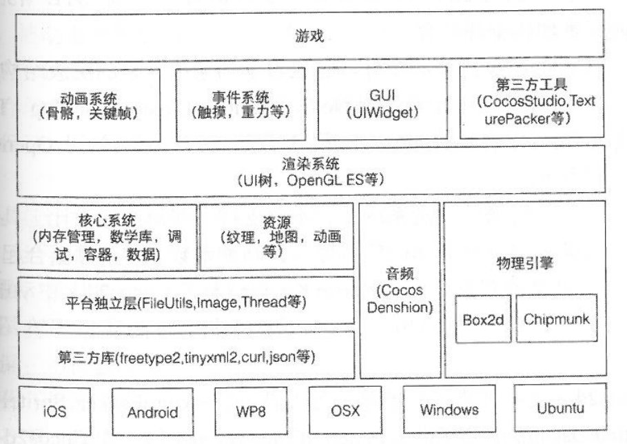

# Cocos



### Cocos2d-x 内存
--

#### C++ 11 智能指针
```c++
C++ 11 使用3种不同的智能指针: unique_ptr、shared_ptr、weak_ptr(属于模板类型)
int main(){
    unique_ptr<int> up1(new int(11));
    unique_ptr<int> up11 = up1; // 编译报错

    shared_ptr<int> up2(new int(22));
    weak_ptr<int> up3 = up2;
}

// 每个智能指针都重载了 "*" 运算符，可以使用 "*up1" 访问所分配的堆内存。
// 智能指针在析构或者调用reset成员时，都可能释放其所拥有的堆内存
/*
区别:
    > unique_ptr指针不能与其他智能指针共享所指对象的内存，如"up1"赋值给 "up11" 将导致编译报错。但是，可以通过标准库的 move 函数来转移 unique_ptr 指针对象的 "所有权"，一旦转移成功，原来的 unique_ptr 指针就失去了对对象的所有权，再使用该指针会导致运行时错误。
    > 多个shared_ptr指针可以共享同一堆分配对象的内存，它在实现采用引用计数。即使一个shared_ptr指针放弃了所有权(调用reset成员或离开其作用域)，也不会影响其他智能指针对象。只有所有引用计数归0，才会真正释放所占有的堆内存。
    > weak_ptr指针可以用来指向shared_ptr指针分配的对象内存，但不拥有该内存。可以使用其lock成员来访问其指向内存的一个shared_ptr对象，当其所指向的内存无效时，返回指针空值(nullptr)。weak_ptr指针通常可以用来验证shared_ptr指针的有效性。
*/

```


END