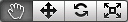

# U3D

- 导入项目

>> Assets->Import Package->Custom Package...

- 工具栏

> 变换工具  
> 平移: 它可以整体平移场景视图。它的快捷键是Q.
> 移动: 它可以在三维坐标内任意平移选择的物体。它的快捷键是W
> 旋转: 它可以绕三个轴向任意选择物体。它的快捷键是E.
> 缩放: 它可以以任意轴向缩放物体。它的快捷键是R。

END